# Tabke of Content
[Objectives of this assignment](#objectives-of-this-assignment)

[Learning outcomes](#learning-outcomes)	

[Prerequisites](#prerequisites)

[Installation and configuration of Serverless Framework-OpenFaas](#installation-and-configuration-of-serverless-framework-openfaas)	

[Step-1:-Set-Up-a-Kubernetes-Cluster-with-Kind-Optional](#step-1-set-up-a-kubernetes-cluster-with-kind-optional)

[Step-2: Deploy OpenFaaS to a Kubernetes Cluster](#step-2-deploy-openfaas-to-a-kubernetes-cluster)

[Step-3: Set Up the OpenFaaS CLI](#step-3-set-up-the-openfaas-cli)	

[Creating serverless Functions using OpenFaas Framework](#creating-serverless-functions-using-openfaas-framework)

[Step-4: Create  a Serverless Function using CLI](#step-4-create-a-serverless-function-using-cli)

[Step-5: Build the Serverless Function](#step-5-build-the-serverless-function)

[Step-5: Push Your Image to Docker Hub](#step-5-push-your-image-to-docker-hub)

[Step-6: Deploy a Function using the CLI](#step-6-deploy-a-function-using-the-cli)

[Step-7: invoke the serverless function using the CLI](#step-7-invoke-the-serverless-function-using-the-cli)

[Step-8: Updated the function](#step-8-updated-the-function)

[Deploy serverless Functions using the Web Interface](#deploy-serverless-functions-using-the-web-interface)

[Step-9: Deploy Serverless Functions Using the Web Interface](#step-9-deploy-serverless-functions-using-the-web-interface) 

[Monitor the serverless with Prometheus and Grafana](#monitor-the-serverless-with-prometheus-and-grafana)

[Step-10: Monitor the serverless with Prometheus and Grafana](#step-10-monitor-the-serverless-with-prometheus-and-grafana)

This tutorial serves as a gentle introduction to the Serverless computing and Function as service, covered in the lecture. The primary goal is to learn to use an Opensource Serverless Platform (OpenFaaS). The main focus of this assignment is to teach you how to deploy a OpenFaaS cluster using K8s. It is important to note that during the assignment you will distinguish the Steps that are performed by the provider of the Function as a service platform (Step1-3) and the Steps that are performed by the users of the platform (Step4-10). 
The tutorial is following the Steps provided in Tutorial Create Serverless Functions with OpenFaaS Published April 7, 2023, in Tutorials, Docker, Managed Kubernetes .  

# Objectives of this assignment
-	Get some introductory hands-on on Open-source Function as a Service platform (OpenFaaS)

Learning outcomes
1.	Learn how to install and deploy OpenFaaS.
2.	Learn how to create a function and depoy it in OpenFaaS.
3.	Learn how to update a function in OpenFaaS.
4.	Learn how to monitor a function in OpenFaaS.

# Prerequisites
- A Kubernetes cluster. If you don't have a running Kubernetes cluster, follow the instructions from the Set Up a Kubernetes Cluster with Kind section below.
- A Docker Hub Account. See the Docker Hub page for details about creating a new account.
- kubectl. Refer the Install and Set Up kubectl page for details about installing kubectl.
- Node.js 10 or higher. To check if Node.js is installed on your computer, enter the following command

```bash
$ node --version
```
 
# Installation and configuration of Serverless Framework (OpenFaas)

## Step-1:  Set Up a Kubernetes Cluster with Kind (Optional).

###  1.	Create a file named openfaas-cluster.yaml, and copy in the following spec

- three node (two workers) cluster config
```bash
kind: Cluster
apiVersion: kind.x-k8s.io/v1alpha4
nodes:
- role: control-plane
- role: worker
- role: worker
```

###  2.	Use the kind create cluster command to create a Kubernetes cluster with one control plane and two worker nodes.

```bash
$ curl -sLS https://dl.get-arkade.dev | sudo sh
```

## Step-2: Deploy OpenFaaS to a Kubernetes Cluster.

###  1.	install arcade  (OpenFaaS installer)

```bash
$ kind create cluster --config kind-specs/kind-cluster.yaml
```

Note: you can also use other installers Helm, …

###  2.	install openfaas using arcade

```bash
$ arkade install openfaas
```

###  3.	verify that the deployments were created, run the kubectl get deployments command.

```bash
$ kubectl get deployments -n openfaas -l "release=openfaas, app=openfaas"
```

Expected outcome (installation Ready)

| NAME              |   READY  |  UP-TO-DATE  |  AVAILABLE  |  AGE | 
| ----------------  | -------  | ------------ | ----------  | ---- | 
| alertmanager      |   1/1    |  1           |  1          |  75s | 
| basic-auth-plugin |   1/1    |  1           |  1          |  75s | 
| faas-idler        |   1/1    |  1           |  1          |  75s | 
| gateway           |   1/1    |  1           |  1          |  75s | 
| nats              |   1/1    |  1           |  1          |  75s | 
| prometheus        |   1/1    |  1           |  1          |  75s | 
| queue-worker      |   1/1    |  1           |  1          |  75s | 


###  4.	Check the rollout status of the gateway deployment.

```bash
$ kubectl rollout status -n openfaas deploy/gateway
```

- Expected outcome (rollout completed )

kubectl port-forward -n openfaas svc/gateway 8080:8080 &


###  5.	Use the kubectl port-forward command to forward all requests made to http://localhost:8080 to the pod running the gateway service.

```bash
$ kubectl port-forward -n openfaas svc/gateway 8080:8080 &
```

- Expected outcome (status of the jobs)

```bash
$ jobs
```

###  6. Retrieve your password and save it into an environment variable named PASSWORD, using the following command.

```bash
$ PASSWORD=$(kubectl get secret -n openfaas basic-auth -o jsonpath="{.data.basic-auth-password}" | base64 --decode; echo)
```

## Step-3: Set Up the OpenFaaS CLI

- following the ## Steps from the Installation page Installation

# Creating serverless Functions using OpenFaas Framework

## Step-4: Create a Serverless Function using CLI

###  1.	Run the following command to see the templates available in the official store.

```bash
$ faas-cli template store list
```
```bash
$ faas-cli template store list -u https://raw.githubusercontent.com/andreipope/my-custom-store/master/templates.json
```
- Note: The Classic templates are based on the Classic Watchdog and use stdio to communicate with your serverless function. Refer to the Watchdog page for more details about how OpenFaaS Watchdog works.
- You can list all the templates.

```bash
$ faas-cli template store list
```


###  2.	Download the official templates locally.

```bash
$ faas-cli template pull.
```

- Expected outcome (status of the jobs)

```bash
Fetch templates from repository: https://github.com/openfaas/templates.git at master.
2020/03/11 20:51:22 Attempting to expand templates from https://github.com/openfaas/templates.git
2020/03/11 20:51:25 Fetched 19 template(s): [csharp csharp-armhf dockerfile go go-armhf java11 java11-vert-x java8 node node-arm64 node-armhf node12 php7 python python-armhf python3 python3-armhf python3-debian ruby] from https://github.com/openfaas/templates.git
```

###  3.	To create a new serverless function, run the faas-cli new command specifying.

```bash
$ faas-cli new appfleet-hello-world --lang node
```

- Note: use a demo function appfleet-hello-world written in node
- Expected outcome ()

Folder: appfleet-hello-world created.
```bash
  ___                   _____           ____
 / _ \ _ __   ___ _ __ |  ___|_ _  __ _/ ___|
| | | | '_ \ / _ \ '_ \| |_ / _` |/ _` \___ \
| |_| | |_) |  __/ | | |  _| (_| | (_| |___) |
 \___/| .__/ \___|_| |_|_|  \__,_|\__,_|____/
      |_|
 

Function created in folder: appfleet-hello-world
Stack file written: appfleet-hello-world.yml

Notes:
You have created a new function which uses Node.js 12.13.0 and the OpenFaaS
Classic Watchdog.
```

```bash
npm i --save can be used to add third-party packages like request or cheerio
npm documentation: https://docs.npmjs.com/
```

For high-throughput services, we recommend you use the node12 template which
uses a different version of the OpenFaaS watchdog.
- 


See the directory structure

```bash
$ tree . -L 2
```

- The appfleet-hello-world/handler.js file contains the code of your serverless function. You can use the echo command to list the contents of this file

```bash
$ cat appfleet-hello-world/handler.js
```


- Expected outcome ()
"use strict"

module.exports = async (context, callback) => {
    return {status: "done"}
}


- You can specify the dependencies required by your serverless function in the package.json file. The automatically generated file is just an empty shell

$ cat appfleet-hello-world/handler.js


- Expected outcome ()
```bash
{
  "name": "function",
  "version": "1.0.0",
  "description": "",
  "main": "handler.js",
  "scripts": {
    "test": "echo \"Error: no test specified\" && exit 1"
  },
  "keywords": [],
  "author": "",
  "license": "ISC"
}
```

- The spec of the appfleet-hello-world function is stored in the appfleet-hello-world.yml file:

```bash
$ cat appfleet-hello-world.yml
```

- Expected outcome ()

```bash
{ version: 1.0
provider:
  name: openfaas
  gateway: http://127.0.0.1:8080
functions:
  appfleet-hello-world:
    lang: node
    handler: ./appfleet-hello-world
    image: appfleet-hello-world:latest
}
```

## Step-5: Build the Serverless Function

###  1.	 Open the appfleet-hello-world.yml file in a plain-text editor and update the image field by prepending your Docker Hub username to it. 

```bash
version: 1.0
provider:
name: openfaas
gateway: http://127.0.0.1:8080
functions:
appfleet-hello-world:
lang: node
handler: ./appfleet-hello-world
image: <YOUR-DOCKER-HUB-ACCOUNT>/appfleet-hello-world:latest
```

###  2.	Build the function. Enter the faas-cli build command specifying the -f argument with the name of the YAML file you edited in the previous ## Step (appfleet-hello-world.yml)

```bash
$ faas-cli build -f appfleet-hello-world.yml
```

###  3.	You can list your Docker images with

```bash
$ docker images
```

## Step-5: Push Your Image to Docker Hub
###  1.	Log in to Docker Hub. Run the docker login command with the --username flag followed by your Docker Hub username. The following example command logs you in as <Docker Hub user name>

```bash
$ docker login --username <Docker Hub username>
```

- Next, you will be prompted to enter your Docker Hub password:

```bash
Password:
Login Succeeded
```

###  2.	Use the faas-cli push command to push your serverless function to Docker Hub:

```bash
$ faas-cli push -f appfleet-hello-world.yml
```

## Step-6: Deploy a Function using the CLI.

###  1.	With your serverless function pushed to Docker Hub, log in to your local instance of the OpenFaaS gateway by entering the following command:

```bash
$ echo -n $PASSWORD | faas-cli login --username admin --password-stdin
```

###  2.	Run the faas-cli deploy command to deploy your serverless function:


```bash
$ faas-cli deploy -f appfleet-hello-world.yml
```

- Expected outcome ()

```bash
Deploying: appfleet-hello-world.
WARNING! Communication is not secure, please consider using HTTPS. Letsencrypt.org offers free SSL/TLS certificates.
Handling connection for 8080
Handling connection for 8080

Deployed. 202 Accepted.
URL: http://127.0.0.1:8080/function/appfleet-hello-world
```

###  3.	Use the faas-cli list command to list the functions deployed to your local OpenFaaS gateway.

```bash
$ faas-cli list
```
- Expected outcome ()
```bash
faas-cli list --gateway https://<YOUR-GATEWAT-URL>:<YOUR-GATEWAY-PORT>
```


###  4.	You can use the faas-cli describe method to retrieve more details about the appfleet-hello-world function.

```bash
$ faas-cli describe appfleet-hello-world
```


- Expected outcome ()

```bash
Name:                appfleet-hello-world
Status:              Ready
Replicas:            1
Available replicas:  1
Invocations:         1
Image:               andreipopescu12/appfleet-hello-world:latest
Function process:    node index.js
URL:                 http://127.0.0.1:8080/function/appfleet-hello-world
Async URL:           http://127.0.0.1:8080/async-function/appfleet-hello-world
Labels:              faas_function : appfleet-hello-world
Annotations:         prometheus.io.scrape : false
```

## Step-7: invoke the serverless function using the CLI.

###  1.	To see your serverless function in action, issue the faas-cli invoke command, specifying:

- The -f flag with the name of the YAML file that describes your function (appfleet-hello-world.yml)
- The name of your function (appfleet-hello-world)

```bash
$ faas-cli invoke -f appfleet-hello-world.yml appfleet-hello-world
```

- Expected outcome ()

```bash
Reading from STDIN - hit (Control + D) to stop.
```


###  2.	Type CTRL+D. The following example output shows that your serverless function works as expected.

- Expected outcome ()

```bash
appfleet
Handling connection for 8080
{"status":"done"}
```
## Step-8: Updated the function

The function you created, deployed, and then invoked in the previous sections is just an empty shell. In this section, we will update it to:

- Read the name of a city from stdin
- Fetch the weather forecast from the openweathermap.org
- Print to the console the weather forecast

###  1.	Create an OpenWeatherMap account by following the instructions from the Sign Up page:

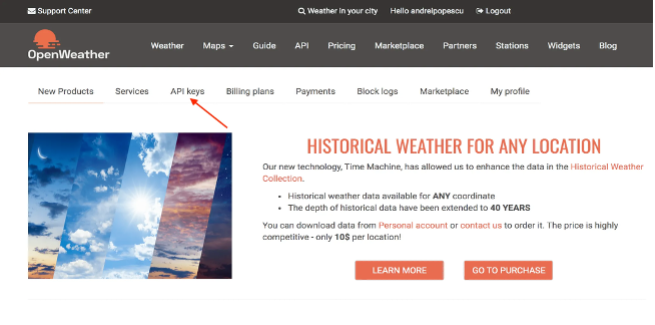

###  2.	log in to OpenWeatherMap and then select API KEYS:


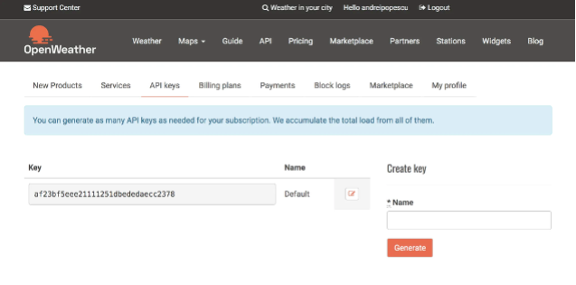


###  3.	from here, you can either copy the value of the default key or create a new API key, and then copy its value:


$ TODO


###  4.	Now that you have an OpenWeatherMap API key, you must use npm to install a few dependencies. The following command moves into the appfleet-hello-world directory and then installs the get-stdin and request packages:

```bash
$ cd appfleet-hello-world && npm i --save get-stdin request
```

###  5.	replace the content of the handler.js file with:

```bash
"use strict"
const getStdin = require('get-stdin')
const request = require('request');

let handler = (req) => {
  request(`http://api.openweathermap.org/data/2.5/weather?q=${req}&?units=metric&APPID=<YOUR-OPENWEATHERMAP-APP-KEY>`, function (error, response, body) {
    console.error('error:', error)
    console.log('statusCode:', response && response.statusCode)
    console.log('body:', JSON.stringify(body))
  })
};

getStdin().then(val => {
   handler(val);
}).catch(e => {
  console.error(e.stack);
});

module.exports = handler
```

###  6.	You can use the faas-cli remove command to remove the function you’ve deployed earlier in this tutorial:

```bash
$ faas-cli remove appfleet-hello-world
```


- Expected outcome ()

```bash
Deleting: appfleet-hello-world.
Handling connection for 8080
Removing old function.
```

###  7.	Now that the old function has been removed, you must rebuild, push, and deploy your modified function. Instead of issuing three separate commands, you can use the openfaas-cli up command as in the following example:

```bash
$ faas-cli up -f appfleet-hello-world.yml
```

- The following example command skips the push ## Step:

```bash
$ faas-cli up -f appfleet-hello-world.yml --skip-push
```
- The following example command skips the deploy ## Step:
```bash
$ faas-cli up -f appfleet-hello-world.yml --skip-deploy
```

###  8.	To verify that the updated serverless function works as expected, invoke it as follows:

```bash
$ faas-cli invoke -f appfleet-hello-world.yml appfleet-hello-world
```
- Expected outcome ()

```bash
Reading from STDIN - hit (Control + D) to stop.
Berlin
Handling connection for 8080
Hello, you are currently in Berlin
statusCode: 200
body: "{\"coord\":{\"lon\":13.41,\"lat\":52.52},\"weather\":[{\"id\":802,\"main\":\"Clouds\",\"description\":\"scattered clouds\",\"icon\":\"03d\"}],\"base\":\"stations\",\"main\":{\"temp\":282.25,\"feels_like\":270.84,\"temp_min\":280.93,\"temp_max\":283.15,\"pressure\":1008,\"humidity\":61},\"visibility\":10000,\"wind\":{\"speed\":13.9,\"deg\":260,\"gust\":19},\"clouds\":{\"all\":40},\"dt\":1584107132,\"sys\":{\"type\":1,\"id\":1275,\"country\":\"DE\",\"sunrise\":1584077086,\"sunset\":1584119213},\"timezone\":3600,\"id\":2950159,\"name\":\"Berlin\",\"cod\":200}"
```


###  9.	To clean-up, run the faas-cli remove command with the name of your serverless function (appfleet-hello-world as an argument):

```bash
$ faas-cli remove appfleet-hello-world
```

- Expected outcome ()
```bash
Deleting: appfleet-hello-world.
Handling connection for 8080
Removing old function.
```

# Deploy serverless Functions using the Web Interface

## Step-9: Deploy Serverless Functions Using the Web Interface

1.	Open a browser and visit http://localhost:8080 . To log in, use the admin username and the password you retrieved in the previous ## Step. You will be redirected to the OpenFaaS home page. Select the DEPLOY NEW FUNCTION button:


 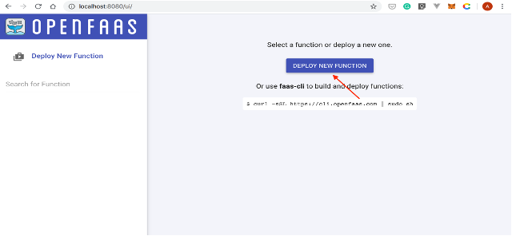


2.	A new window will be displayed. Select the Custom tab, and then type:


 
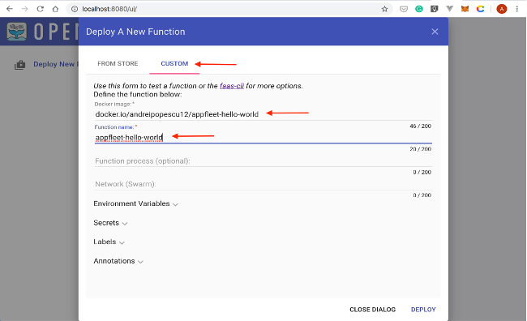 

3.	Once you’ve filled in the Docker image and Function name input boxes, select the DEPLOY button:

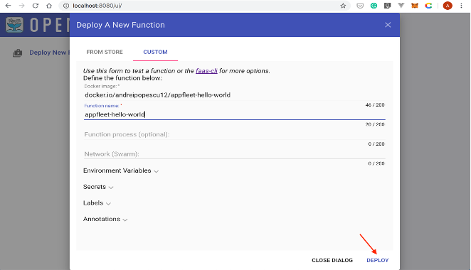
 


4.	Your new function will be visible in the left navigation bar. Click on it:


 
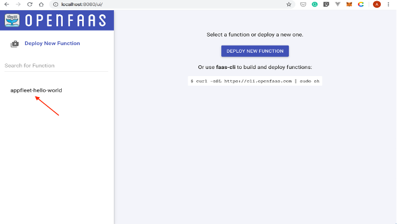 

5.	You’ll be redirected to the invoke function page:


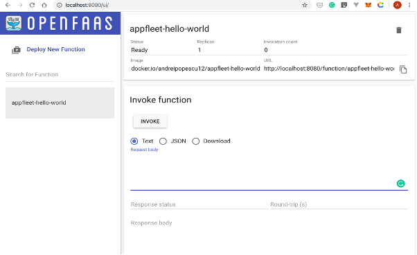


6.	In the Request body input box, type in the name of the city you want to retrieve the weather forecast for, and then select the INVOKE button:


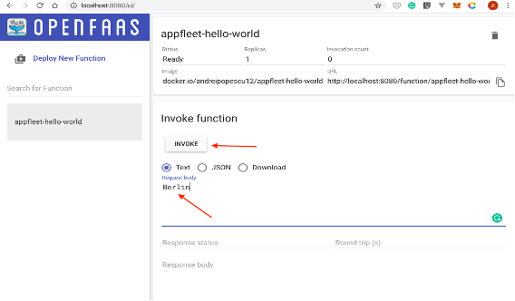 


- Expected outcome ()

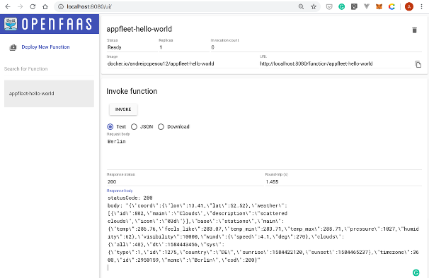 
 
# Monitor the serverless with Prometheus and Grafana

The OpenFaaS gateway exposes the following metrics:
 
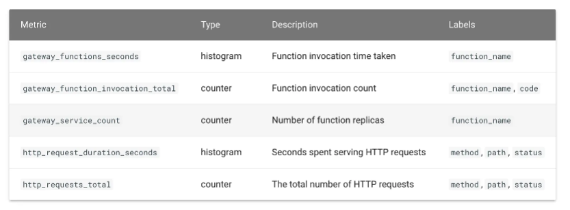

Retrieved from https://docs.openfaas.com/architecture/metrics/

## Step-10: Monitor the serverless with Prometheus and Grafana 
  
###  1.	Use the following command to list your deployments:

```bash
$ kubectl get deployments -n openfaas -l "release=openfaas, app=openfaas"
```
- Expected outcome ()


###  2.	To expose the prometheus deployment, create a service object named prometheus-ui:

```bash
$ kubectl expose deployment prometheus -n openfaas --type=NodePort --name=prometheus-ui
```

- Expected outcome ()


###  3.	To inspect the prometheus-ui service, enter the following command:

```bash
$ kubectl get svc prometheus-ui -n openfaas
```
- Expected outcome ()


###  4.	Forward all requests made to http://localhost:9090 to the pod running the prometheus-ui service:

```bash
$ kubectl port-forward -n openfaas svc/prometheus-ui 9090:9090 &
```
- Expected outcome ()


###  5.	Now, you can point your browser to http://localhost:9090 , and you should see a page similar to the following screenshot:

- Expected outcome ()
 
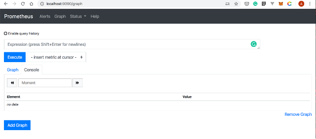

###  6.	To deploy Grafana, you’ll the stefanprodan/faas-grafana:4.6.3 image. Run the following command:

```bash
$ kubectl run grafana -n openfaas --image=stefanprodan/faas-grafana:4.6.3 --port=3000
```

- Expected outcome ()


###  7.	Now, you can list your deployments with:


```bash
$ kubectl get deployments -n openfaas
```
- Expected outcome ()


###  8.	Use the following kubectl expose deployment command to create a service object that exposes the grafana deployment:

```bash
$ kubectl expose deployment grafana -n openfaas --type=NodePort --name=grafana
```

- Expected outcome ()


###  9.	Retrieve details about your new service with:

```bash
$ kubectl get service grafana -n openfaas
```

- Expected outcome ()


###  10.	Forward all requests made to http://localhost:3030 to the pod running the grafana service:

```bash
kubectl port-forward -n openfaas svc/grafana 3000:3000 &
```
- Expected outcome ()


###  11.	Now that you set up the port forwarding, you can access Grafana by pointing your browser to http://localhost:3000:

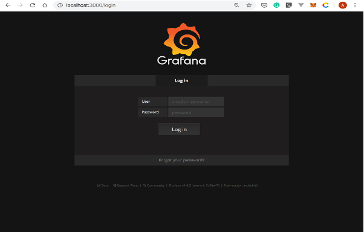
 


###  12.	Log into Grafana using the username admin and password admin. The Home Dashboard page will be displayed:

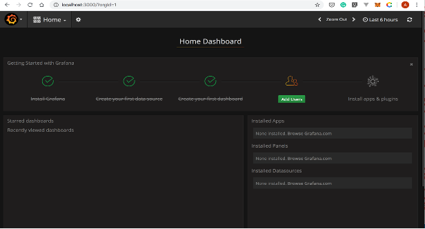
 


###  13.	From the left menu, select Dashboards –> Import:


 
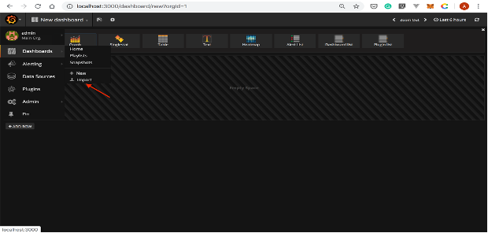

###  14.	Type https://grafana.com/grafana/dashboards/3434  in the Grafana.com Dashboard input box. Then, select the Load button:


 
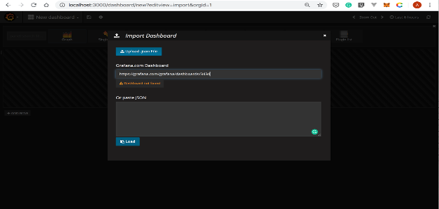


###  15.	In the Import Dashboard dialog box, set the Prometheus data source to faas, and then select Import:


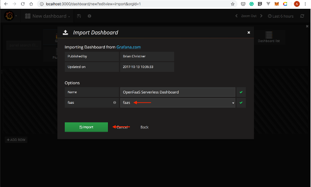


###  16.	An empty dashboard will be displayed:
- Expected output.

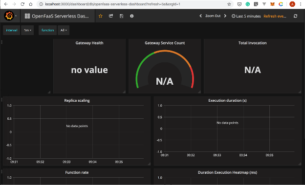

###  17.	Now, you can invoke your function a couple of times using the faas-cli invoke command as follows:

```bash
$ faas-cli invoke -f appfleet-hello-world.yml appfleet-hello-world 
```

###  18.	Switch back to the browser window that opened Grafana. Your dashboard should be automatically updated and look similar to the following screenshot:


