# A Brief History of AI  
## From Foundations to Generative AI

- Presenter:   
- Core idea: to understand today’s AI, we must know its **history and shifts**

> “A generation which ignores history has no past – and no future.”  
> — Robert A. Heinlein

---

# The Elusive Definition of Intelligence

- “As soon as it works, no one calls it AI anymore.” — John McCarthy  
- Intelligence is a **moving target** as technologies become routine.
- Today: AI literacy is no longer only for computer scientists.
- Students in **all disciplines** must:
  - Evaluate when AI is appropriate
  - Defend or challenge model choices for their domain

---

# Roadmap of This Talk

- **Foundations of Computing**
  - Traditional programming vs. data‑centric learning
- **The Scaling Problem**
  - Data, storage, and compute infrastructure
- **The AI Landscape**
  - AI vs. Machine Learning vs. Deep Learning
- **Historical Milestones**
  - From early neural nets to Transformers
- **Trust, Safety & Boundaries**
  - Adversarial risk, privacy, and ethics (high‑level preview)

---

# SECTION I  
## Historical Evolution of AI

---

# AI Roots (1940s–1950s)

Foundational ideas:

- **1943 – McCulloch & Pitts**
  - First mathematical model of a **neuron**
  - Basis for artificial neural networks
- **1950 – Alan Turing**
  - Proposes the **Turing Test**:
  
- **1956 – Dartmouth Workshop**
  - McCarthy, Minsky, Rochester, Shannon
  - Coins the term **“Artificial Intelligence”**

 
  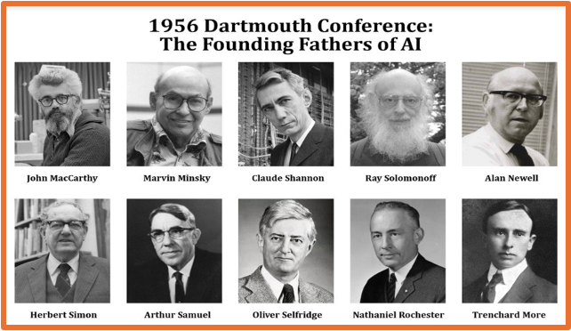

---

# Mapping the AI Landscape

Nested vocabulary (conceptual diagram):

- **Artificial Intelligence**
  - Rule‑based systems, search, logic
  - ⮡ **Machine Learning**
    - Linear/logistic regression, random forests, SVMs
    - ⮡ **Deep Learning**
      - MLPs, CNNs, RNNs, LSTMs, autoencoders
      - ⮡ **Generative AI**
        - GANs, Transformers, Large Language Models (LLMs)

> Not all AI is ML; not all ML is deep learning; not all deep learning is generative.

---
# Nested vocabulary (conceptual diagram)

<!-- 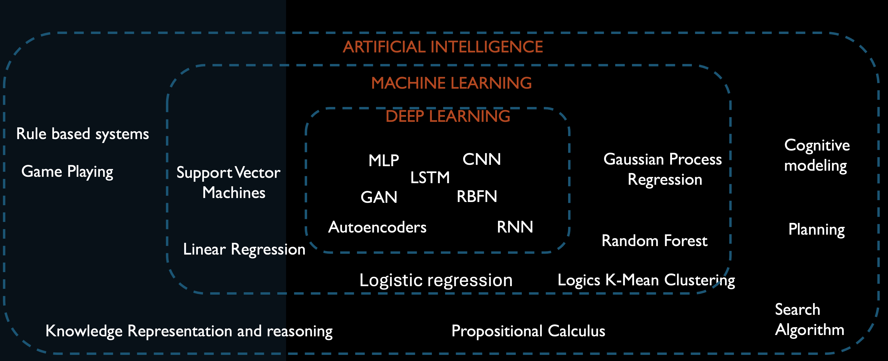 -->

---

# The McCulloch-Pitts Neuron (1943)

- Inspired by neuroscience: 
The brain is composed of neurons interacting via synapses, transmitting either excitatory or inhibitory signals
-  The neuron can be thought of as a binary classifier 
using binary input
- A neuron 
   - fires if: sum of inputs reaches threshold 
   - unless inhibited by other inputs

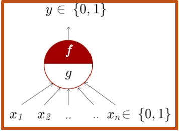
---

---

# The Perceptron (1957)

- Frank Rosenblatt's original work on the perceptron in the late 1950s laid the groundwork for subsequent research in neural network theory and applications. 
 
 > The perceptron model demonstrated the potential of neural networks for pattern recognition tasks

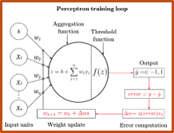

---

# General Purpose Solver (GPS) (1957)

- GPS by Herbert Simon, J.C. Shaw, and Allen Newell 
  - a computer program created intended to work as a universal problem solver machine
  - employs heuristic search to explore possible solutions

> ability to reason and make decisions based on logical inference and problem-solving strategies

---

# Expert Systems: Eliza (1966)  - short video

---
# Expert Systems: Eliza (1966)  - short video

<video controls src="[https://www.youtube.com/embed/8jGpkdPO-1Y]" width="800" height="450"></video>

---

# Expert Systems: SHRDLU (1968) - short video

<video controls src="[https://www.youtube.com/embed/bo4RvYJYOzI]" width="800" height="450"></video>

---
#  The Perceptron (controversy) - Minsky and Papert (1969)

- A single perceptron is unable to compute the XOR function, as it’s not linearly separable

> Minsky and Papert.  “Perceptron: An Introduction to Computational Geometry”, book 1969
 
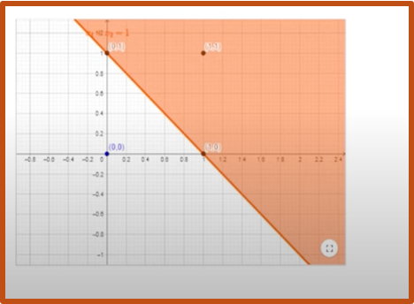

---

# Expert Systems: Symbolic AI at Scale

- **Dendral (1960s)**  : Helped chemists identify molecules from mass spectra.
- **MYCIN (1970s)**  : Diagnosed bacterial infections, recommended antibiotics.
- **XCON (late 1970s–1980s)**  : Configured VAX computers at DEC; saved tens of millions of dollars.
- **Deep Blue (1990s)**  : Defeated world chess champion Garry Kasparov using search + rule‑based evaluation.

> These systems showed symbolic AI **can work very well** in **narrow, structured domains**.

---
# The Multi-layer Perceptron

Training before MLP was challenging and less systematic
- Perceptron Learning Rule
- Heuristic Methods
- Optimization Techniques
- Evolutionary Algorithms

Paul Werbos in 1974 laid the foundation
>for training neural networks with **multiple layers of neurons**, which became known as  the backpropagation algorithm

---

# Birth of  Deep Learning

Deep learning models:

- Stack many **hidden layers** to learn complex features from raw data.

- **Forward pass**
  - Data flows through layers to produce an output
  - Compute loss vs. ground truth
- **Backward pass (backpropagation)**
  - **chain rule** to compute gradients layer by layer
  - Update weights to reduce loss

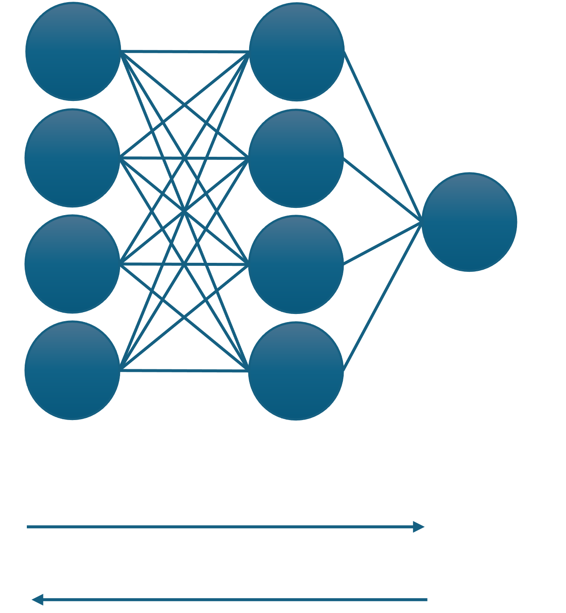

---
# Evolution of Deep learning

<!--- 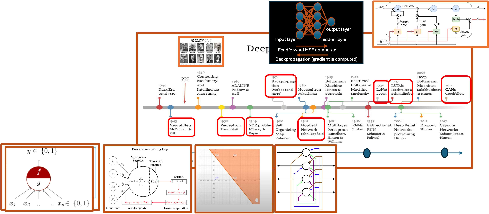 -->

---

# From Hand‑Crafted to Learned Features

Evolution in **computer vision**:

- Early era:
  - Hand‑crafted features + probabilistic models (e.g. HMMs for sequences)
- Deep learning era:
  - **Convolutional Neural Networks (CNNs)**:
    - Automatically learn spatial patterns (edges, textures, objects)
    - Dramatically outperform manual feature pipelines

CNNs shifted vision from **feature engineering** to **feature learning**.

---

# Recurrent Neural Network (1997)

- A recurrent neural network used in speech recognition and NLP. 
-  RNNs recognize data's sequential characteristics and use patterns to predict the next likely scenario

> Solves the problem - vanishing and exploding gradients
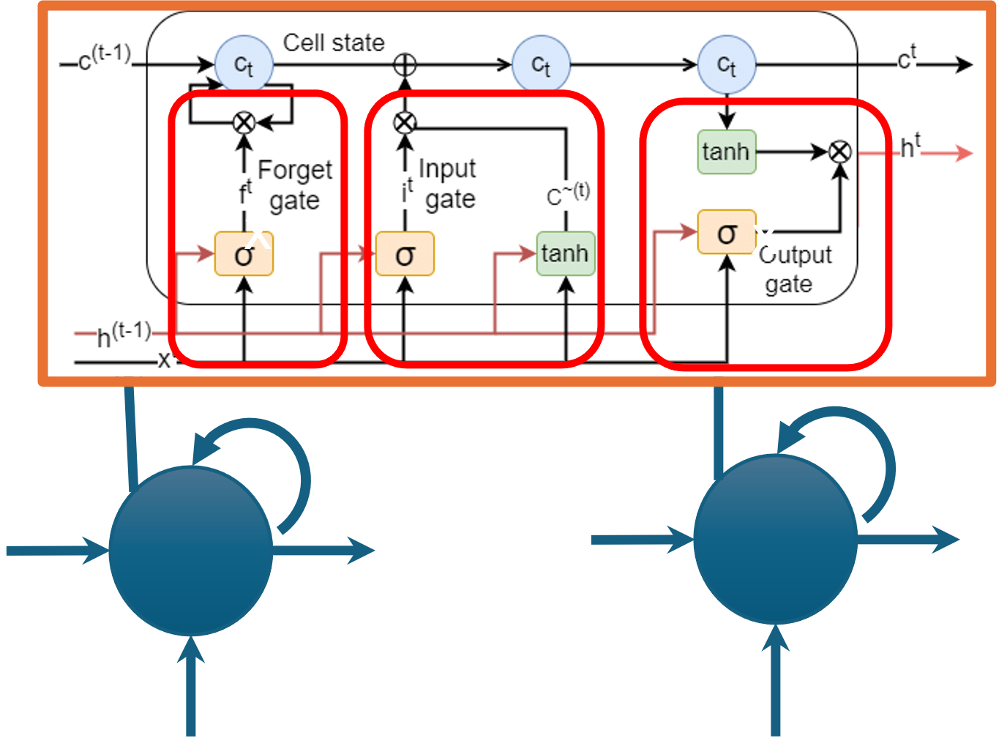

---

# Convolution Neural Network (1998)

**LeNet‑5 (Yann LeCun)**

- Introduced:
  - Local receptive fields
  - Shared weights (convolutions)
  - Subsampling / pooling
- Achieved ≈ **99% accuracy** on digit recognition

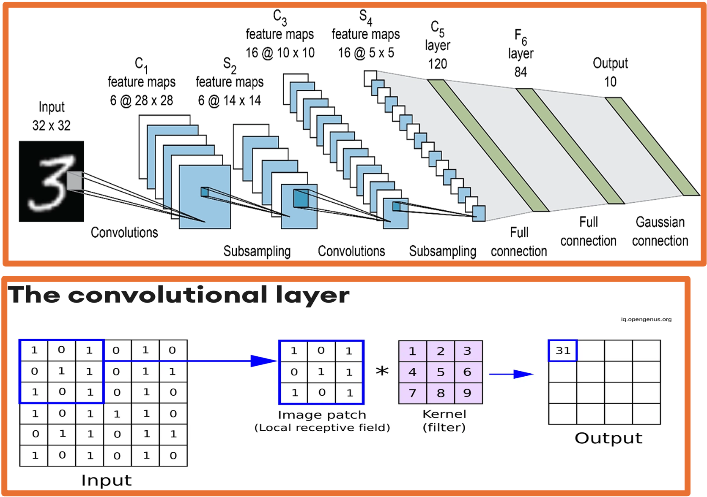

---
# CNN, RNN, LSTM
<!--- 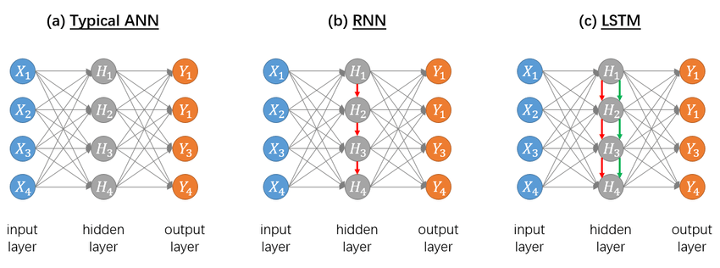 -->

---

# CMNIST dataset (1998)

- Handwritten digits 0–9
- Became a standard benchmark for image recognition

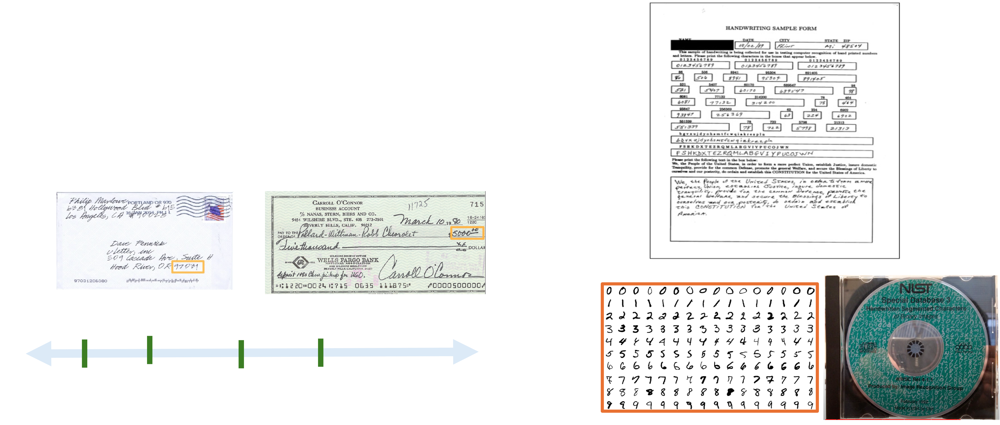

---

# Beyond Digits: CIFAR Datasets

**CIFAR‑10 / CIFAR‑100 (2009)**

- Small natural images across many classes:
  - Animals, vehicles, everyday objects
- Posed a harder challenge than MNIST:
  - Complex backgrounds
  - Varying lighting, viewpoints, clutter

> These datasets tested whether models could **generalize** to realistic, high‑variation images.

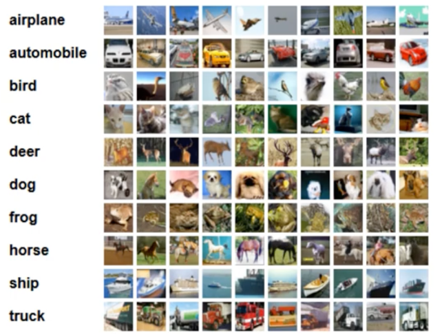

---

# ImageNet: The Deep Learning Breakthrough

**ImageNet Large Scale Visual Recognition Challenge (ILSVRC)**

- Annual competition (2010–2017)
- Millions of images, 1000+ categories

**2012 Inflection Point**

- **AlexNet** (Krizhevsky, Sutskever, Hinton):
  - Deep CNN, trained on GPUs
- Sparked the modern **deep learning boom** in vision and beyond.

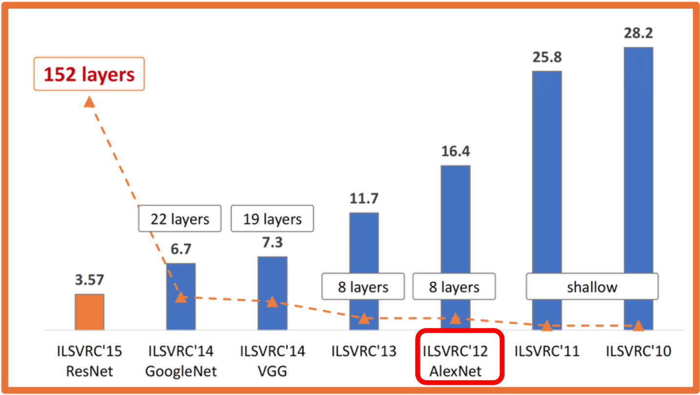

---

# Deep Reinforcement Learning Milestones

**Deep Q‑Networks (DQN) – 2013**

- Mnih et al. (DeepMind)
- Combined: Deep neural nets + Q‑learning Learned Atari games directly from **pixels** via trial and error.

**AlphaGo – 2016**

- DeepMind’s system defeated **Lee Sedol**, Go world champion.
- Combined: Deep learning, Monte‑Carlo tree search, reinforcement learning
- Showed deep RL can master extremely complex strategy spaces.

---

- MLPs or CNNs used for classification—the architecture was a direct, continuous mapping from input to output.
   - The Structure: Input $\rightarrow$ Hidden Layer 1 $\rightarrow$ Hidden Layer 2 $\rightarrow$ Output.

The Goal: 
> Every layer's job was simply to distort, rotate, and scale the data space to make the final classes linearly separable.

limits:
> good classification but not for sequence-to-sequence tasks (like translating) or unsupervised representation learning
---
# Encoder–Decoder Architectures

Why encoder–decoder?

- **Encoder**:
  - Compresses high‑dimensional input (image, audio, text)  
    into a compact **feature representation**.
- **Decoder**:
  - Expands that representation into a new output format:
    - Pixel‑wise segmentation map / Translated sentence / Synthesized audio

---

Example:

- **U‑Net** (2015): Encoder–decoder CNN for medical image segmentation  
  - Produces **pixel‑level** output from image inputs.

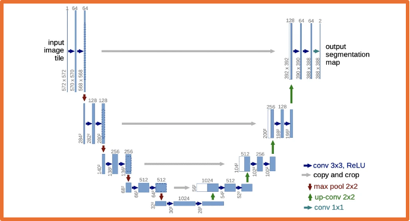

---

# SECTION II  
## Generative AI & Large Language Models

- Generating **new** content, not just classifying data
- Multi‑modal synthesis (text, image, audio, code)
- GANs, Transformers, and the rise of **LLMs**

---

# What Is Generative AI?

**Definition**

- Subfield of AI focused on **creating new data**:
  - Natural language text
  - Images and video
  - Audio and music
  - Code and other artifacts

**High‑level flow**

- Massive training data → **GenAI model** → new synthetic outputs
- Model learns **patterns**, not exact copies of training data.

---

# Multi‑Modal Output Capabilities

Modern generative models can produce:

- **Audio**
  - Text‑to‑speech, music composition, voice cloning
- **Video**
  - Short clips from text prompts, trailer generation, restoration
- **Images**
  - Concept art, style transfer, in‑painting, design assets
- **Text**
  - Creative writing, summarization, translation, code generation

> Same core idea: map a **prompt** → a **new artifact**.

---

# Generative Adversarial Networks (GANs)

Two‑network competitive setup:

- **Generator**: Tries to create fake samples that look real.
- **Discriminator**:  Tries to distinguish **real** vs **fake** samples.

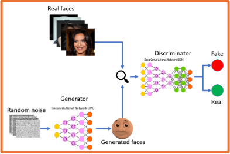

---

# Generative Adversarial Networks (GANs)
Training loop:

1. Generator produces synthetic data.
2. Discriminator scores it.
3. Both networks update based on each other’s performance.

---

# Language Models & Embeddings

**Language Models (LMs)**

- Neural networks trained on large text corpora.
- Goal: model the **probability** of word sequences.

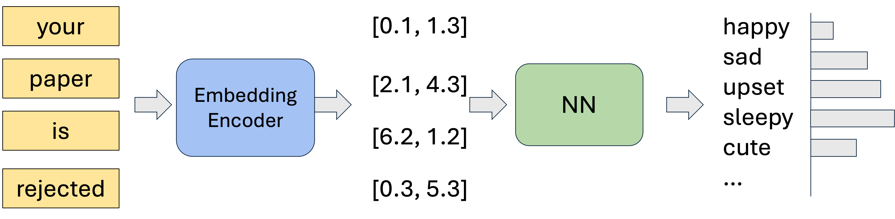

---

**Embeddings**

- Map words/tokens → dense numeric vectors.
- Words with similar meaning appear **close** in embedding space:
  - “Grandparent” near “elderly”, “adult”
  - “Infant” near “baby”, “child”

> Embeddings turn discrete language into **continuous geometry**.

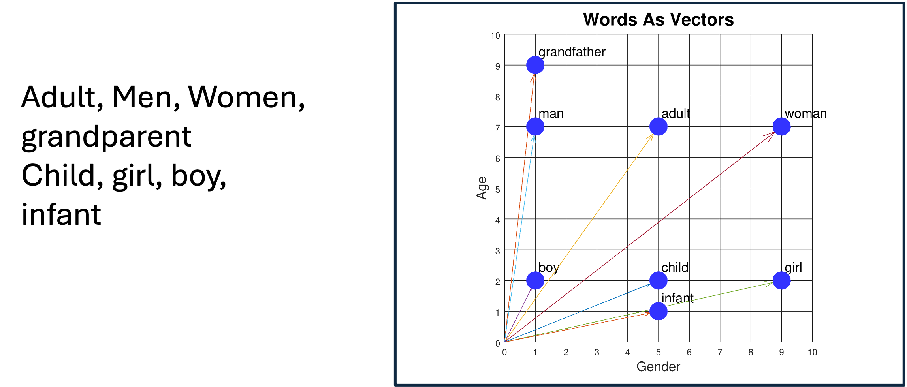

---

# Context Problems in Static Embeddings

Early embeddings gave **one fixed vector per word**:

- Word “mean” had a single representation, regardless of context:

  - “What do you **mean**?” (verb)
  - “You are being **mean**.” (adjective)
  - “The **mean** absolute error.” (math term)

Limitation:

> Model loses **context‑specific meaning** → confusion and errors.
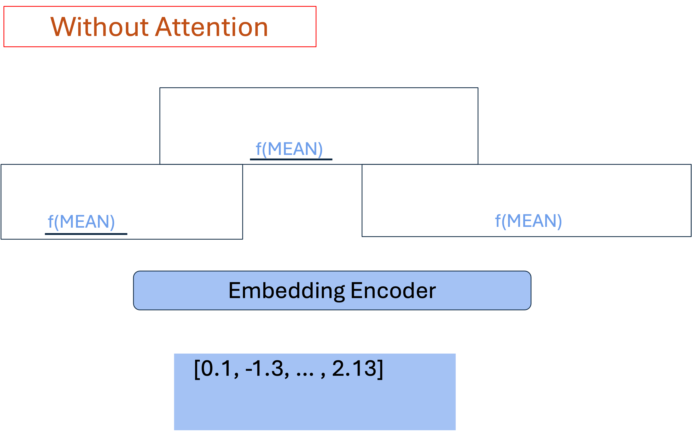

---

# The Transformer Revolution

**Transformers** (Vaswani et al., 2017 – “Attention Is All You Need”):

- Replaced recurrence with **attention mechanisms**.
- Key ideas:
  - **Self‑attention**: each token can look at **all other tokens**.
  - Learn which parts of the input are most relevant for each position.

<!-- Benefits:

> Handles long‑range dependencies.
> Captures context so “mean” next to “absolute error” is clearly mathematical.
-->
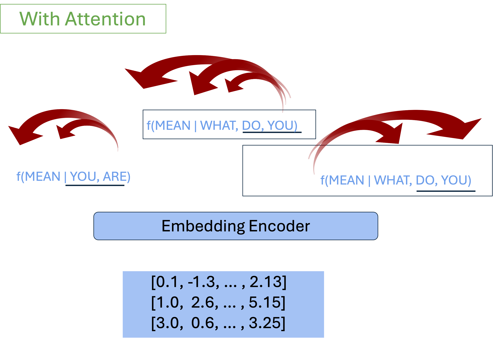

---

# Self‑Attention: Disambiguating “Bank”

Attention weights connect words to their **context clues**.

Example A (financial):

- “I put my **money** in the **bank**.”

- Attention links “bank” strongly to “money” → financial institution.

Example B (river):

- “The **river** overflowed its **bank**.”

- Attention links “bank” to “river” → geographic feature.

The same word gets **different internal representations** depending on context.

---

# Large Language Models (LLMs)

Characteristics:

- **Billions+** of parameters
- Trained on **hundreds of GBs** of text
  - Equivalent to tens of thousands of full book series

Emergence:

- Above certain scale, models show **unexpected abilities**:
  - Multi‑step reasoning
  - Few‑shot learning from just a handful of examples
  - Following complex natural language instructions

---

# GPT and Next‑Token Prediction

**GPT = Generative Pre‑trained Transformer**

Core mechanism:

- Given previous tokens, predict the **next token**.
- Repeat many times → full paragraph, answer, or dialogue.

Training phases:

1. **Pre‑training**
   - Learn general language statistics from massive unlabeled text.
2. **Fine‑tuning / alignment**
   - Specialize on tasks, instructions, or safety goals.

<!--- Simple objective → surprisingly rich behavior. -->

---

# From Base Model to Assistant

1. **Unsupervised pre‑training**
   - Learn generic language patterns.
2. **Supervised fine‑tuning**
   - Train on curated Q&A and instructions.
3. **Reward modeling**
   - Learn what humans prefer in responses.
4. **RLHF (Reinforcement Learning from Human Feedback)**
   - Optimize the model to be:
     - Helpfulm / Honest / Safer

> This turns a raw LLM into a **useful assistant**.

---

# Timeline of LLM Capabilities

- **2018–2019**
  - Early GPT models show promise of Transformers for text.
  - Assistive robots like CIMON support astronauts on the ISS.
- **2020**
  - GPT‑3 (175B parameters) demonstrates strong few‑shot skills.
  - AlphaFold solves key protein‑folding benchmarks.
- **2023+**
  - GPT‑4 and multimodal models (text + image + more) become widely available.
  - Millions of users access powerful AI tools daily.

---

# Text‑to‑Image Generation

Modern diffusion and transformer‑based image models:

- Turn detailed **text prompts** into images.
- Control:
  - Style (photorealistic, sketch, anime, etc.)
  - Composition and layout
  - Lighting and atmosphere

Example:

> “A cinematic night‑time Tokyo street scene, neon lights, rainy reflections”  
> → model generates multiple matching images.

---

# Generative Video Capabilities

Recent video models can:

- Generate **short clips** directly from text prompts.
- Maintain **temporal coherence**:
  - Objects persist across frames
  - Motion appears natural
- Approximate simple **physics**:
  - Lighting changes
  - Camera pans and zooms
  - Basic interactions

> Potential uses: pre‑visualization, VFX, education, rapid prototyping.

---

# Changing Academic Workflows (Expert projections):

- By mid‑2020s, advanced AI assistants can:
  - Help explore conjectures
  - Sketch proofs and counterexamples
  - Generate code and experiments

Implications:

- Human researchers focus more on:
  - Problem formulation
  - Conceptual insight
  - Checking and interpreting AI‑generated work

> AI shifts from **tool** to **collaborator**.

---

# SECTION III 
## System Safety, Exploits & Vulnerabilities

---

# Hallucinations in LLMs

- LLM outputs that are: 
  - Fluent and confident
  - But **factually wrong or invented**

Why it happens:

- Models optimize for **likely text**, not for truth.
- They do not have built‑in verified knowledge bases.

Real‑world example:

- In *Mata v. Avianca*, a lawyer used ChatGPT to find cases.
- The model fabricated legal citations → court sanctions.

---

# Logic & Reasoning Failure Modes 

Pure language models can:

- Follow common text patterns
- But sometimes fail at **precise logical reasoning**

Example: “A juggler juggles 16 balls. Half are golf balls, and half of the golf balls are blue. How many blue golf balls?”

- Incorrect shortcut: “Half of 16 → 8” (ignores the second “half”)  
- Correct reasoning:   16 balls → 8 golf balls → 4 blue golf balls.

Modern reasoning‑tuned models do better, but the limitation is fundamental:  
> models track **token probabilities**, not explicit symbolic logic.

---

# Mitigating Hallucinations in Practice

Defensive strategies:

- **Contextual constraints**
  - System prompts with explicit rules and boundaries.
- **Conversation framing**
  - Keep the model within a known domain or document scope.
- **Sampling controls**
  - Lower “temperature” or adjust decoding to reduce wild outputs.
- **Post‑processing**
  - Sanity checks, format validation, or secondary verification tools.

> Goal: encourage **grounded**, not speculative, answers.

---

# Static Knowledge vs Dynamic Reality

Limitations of static training: After training, an LLM’s internal knowledge is **frozen** at a **cutoff date**.
- It cannot:
  - Natively know post‑cutoff events
  - Provide sources or citations for its statements.

Trust issues:

- Without external grounding, users cannot easily:
  - Verify where an answer came from
  - Check if it is up to date

> This motivates hybrid architectures like **RAG**.

---

# Retrieval‑Augmented Generation (RAG)

How RAG works:

1. **User query**: e.g., “Summarize the latest policy from document X.”
2. **Retrieval**: Search external databases / documents for relevant passages.
3. **Augmented prompt**: Combine user question + retrieved context.
4. **Generation**: LLM answers *using that specific context*.
5. **Citations**: System can point back to retrieved sources.

Benefit:

> - Answers are **grounded** in actual documents, reducing hallucinations and updating knowledge without retraining.

---

# Adversarial Security Exploits (Intro)

LLM systems also face **security threats**:

- **Prompt injection**: User tries to override system instructions.
- **Jailbreak attempts**: Crafted prompts to bypass safety filters.
- **Data exfiltration**: Extracting confidential information from integrated systems.

Mitigation requires:

- Careful system prompts and guardrails
- Input/output filtering
- Separation of sensitive tools and data

> *(Deeper security patterns can be expanded in a dedicated session.)*

---

# Security Threats: Prompt Injections & Jailbreaking

As LLMs are wired into tools and workflows, new security risks appear:

- **Prompt injection attacks**: Malicious text tries to override system instructions and safety rules.
- **Indirect injection**: Hidden instructions embedded in web pages / documents that the LLM reads.
- **Common attack patterns**
  - (1) Jailbreak prompts,  (2) Context manipulation (“ignore previous instructions…”), (3) Obfuscated code or data to exfiltrate secrets, (4) Attempts to extract credentials or internal configuration

> Defensive design is as important as model accuracy.

---

# SECTION IV  
## Privacy, Trust & Governance

---

# The Myth of Simple Anonymization

Removing obvious identifiers (name, ID) is **not enough**:

- **Linkage attacks**
  - Cross‑link “anonymous” data with public sources to re‑identify people  
    (e.g., Netflix Prize dataset deanonymization).
- **A‑priori knowledge**
  - Attacker uses a few known facts about someone to locate their record.
- **Composition attacks**
  - Combine multiple releases over time to triangulate identities.

> Conclusion: privacy must be **designed**, not assumed.

---

# Federated Learning: Decentralized Training

Goal: train a **shared model** without centralizing sensitive data.

- **Local training**
  - Each site (e.g. hospital, bank branch) keeps data on‑prem.
  - Trains a model update on its own data.
- **Central aggregation**
  - Only **model updates / weights** are sent to a server.
  - Server aggregates into a global model.

<!---Risks:

- Malicious or poisoned updates
- Information leakage through model parameters --->

> Federated learning improves privacy but does **not** solve it alone.

---

# Differential Privacy: Math‑Backed Protection

Differential Privacy (DP) gives **formal guarantees**:

- **Core idea**
  - Whether or not any single person’s data is in the training set  
    should barely change the model’s outputs.
- **Mechanism**
  - Add carefully calibrated **noise** to: Data | Gradients | Query answers

Example:

- **Randomized response**
  - Individuals sometimes flip answers according to a known probability.
  - Protects individuals while preserving accurate **aggregate statistics**.

---

# Model Inversion & Reconstruction Risks

Without privacy controls, models can **memorize** data:

- **Reconstruction attacks**
  - Adversary probes a trained model to reconstruct training examples:
    - Faces, text snippets, health records, etc.
- **Membership inference**
  - Attacker infers whether a specific person’s data was in the training set.

Mitigation:

- Train with **differential privacy** and regularization.
- Limit access to model internals and predictions.

---

# Explainable AI (XAI)

Why we need explanations: (1) High‑stakes decisions (credit, hiring, medicine, justice) (2) require **justification**, not just accuracy.

Approaches:

- **Global explanations**: Which features matter overall?
- **Local explanations**: Why this particular prediction?

Example method:

- **Feature attribution** (e.g. RISE–style masking)
  - Randomly mask parts of an input (pixels, words)
  - See how prediction changes
  - Highlight the regions that contribute most to the decision.

---

# The Future of Autonomous Agents

Beyond static chat:

- **Traditional LLMs**
  - Reactive: answer questions, translate, summarize.
- **Agentic LLMs**
  - Can:
    - Call tools and APIs
    - Browse the web
    - Write and run code
    - Plan and execute multi‑step tasks

---

# The Future of Autonomous Agents

Research example:

- **Stanford small‑town simulation**
  - Dozens of LLM‑powered agents lived in a sandbox world.
  - They independently:
    - Planned a party
    - Invited others
    - Coordinated schedules
    - Held the event
  - Demonstrated emergent social behavior.

---

# Prompt Engineering: Interacting with LLMs

**Prompt engineering** = designing prompts to steer model behavior  
without changing model weights.

High‑level flow:

- **Target objective** + **system context**  
  ↓
- **Optimized prompt** (instructions, examples, format)  
  ↓
- **High‑precision output** (more reliable and on‑task)

> Good prompts act as a **user‑level programming language** for LLMs.

---

# Core Prompting Strategies

Common patterns:

- **Basic task prompts**
  - Summarization, classification, translation, role‑playing.
- **Zero‑shot prompting**
  - Ask directly, no examples.
- **Few‑shot prompting**
  - Include a handful of input–output examples in the prompt.
- **Chain‑of‑Thought (CoT)**
  - Tell the model: “Think step by step.”
  - Encourages explicit reasoning → often **better accuracy** on logic problems.

---

# Conclusion & Core Takeaways

- **Paradigm shift**
  - From hand‑coded rules → data‑driven optimization and learning.
- **Infrastructure realities**
  - AI is bounded by data volume, network bandwidth, and compute hardware.
- **Safety & governance**
  - Hallucinations, privacy leaks, and prompt injections require  
    careful system design and monitoring.
- **Path forward**
  - Combine **scale and capability** with:
    - Privacy and security
    - Explainability and governance
    - Thoughtful human oversight

---