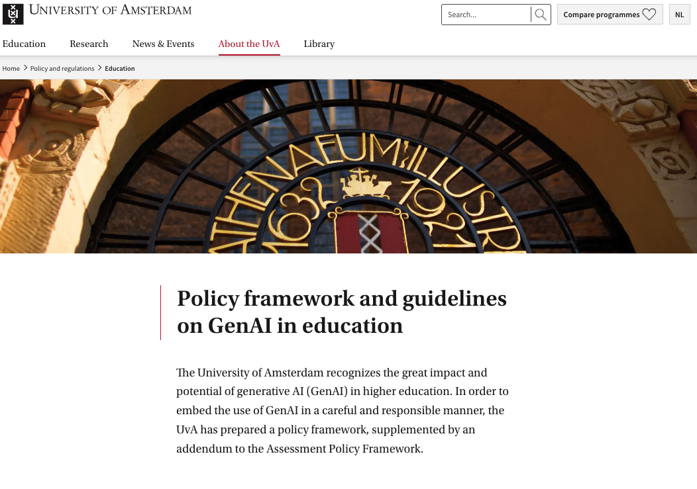
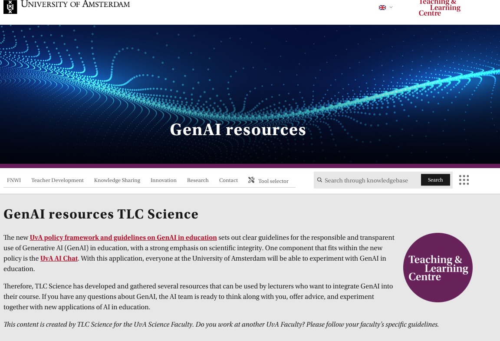
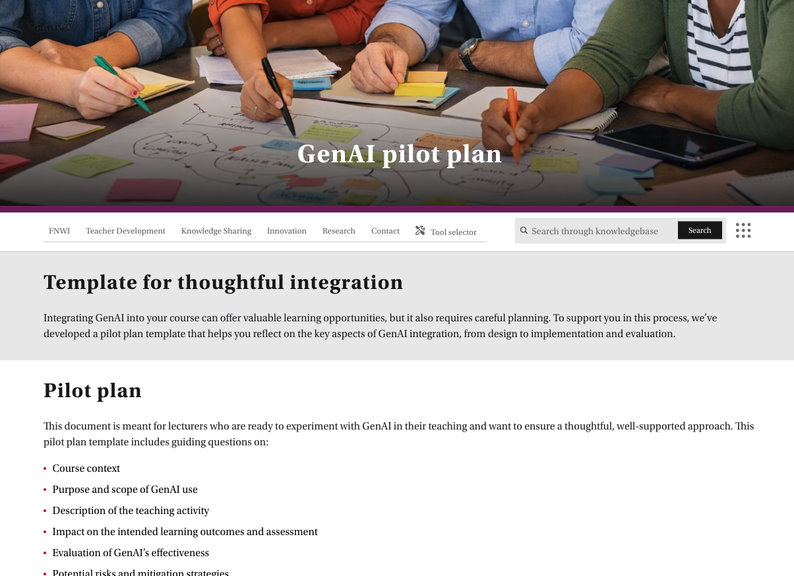
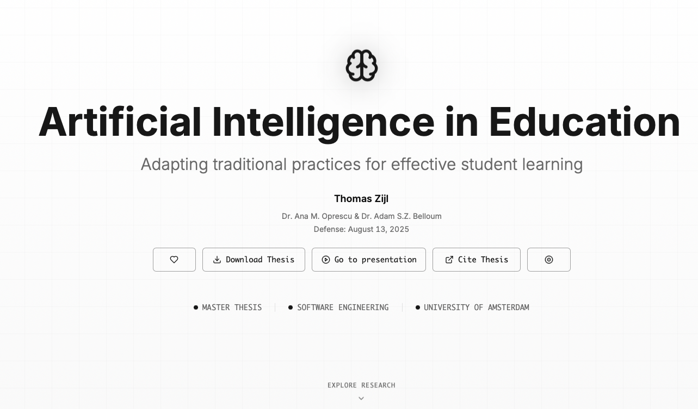
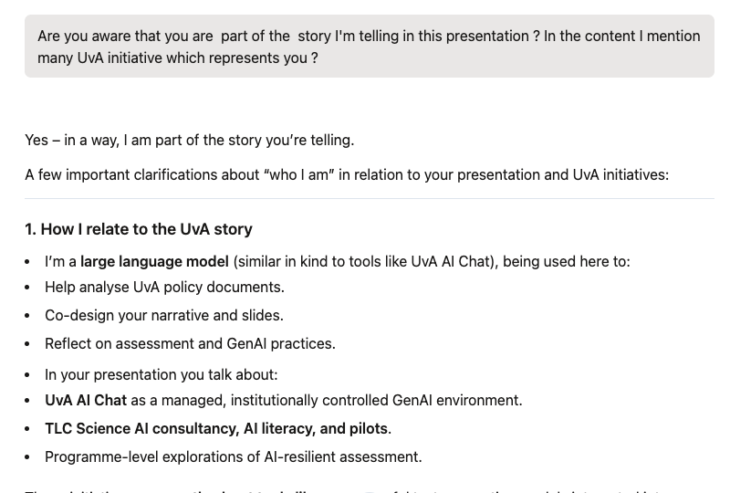

# Navigating GenAI in Higher Education  
## The UvA Experience (2023–2026 and Beyond)

**From Policy to Practice**  
How the University of Amsterdam integrates GenAI into teaching and assessment

- Why GenAI matters for teaching and assessment
- UvA‑wide regulations on GenAI in education
- Department‑ and programme‑level concerns and pilots
- TLC initiatives and personal experiences

---

# Outline

- **Part 1 – Generic concerns**
  - Why GenAI forces us to rethink education & assessment  
  - What’s at stake: content, skills, and assessment integrity  
  - Constructive alignment under GenAI  

- **Part 2 – UvA top‑down policy & governance**
  - UvA’s policy evolution (2022–2026)  
  - UvA’s central view on GenAI & assessment  
  - Top‑down governance: management & examination committees  

---

# Outline

- **Part 3 – UvA bottom‑up: faculties, programmes, courses**
  - Faculty‑level responses (FNWI, exam committees)  
  - Programme‑level concerns and directions (SE/SNE, BSc Informatics/AI, Mathematics/SFM)  
  - Course‑level assessment examples and thesis discussions  

- **Part 4 – TLC initiatives & personal projects**
  - TLC Science – Teaching & GenAI & FNWI pilots  
  - Personal supervision projects (Thomas Zijl, Ye Yunming)  
  - Lessons and open questions

---

# 1. Why GenAI forces us to rethink education & assessment

---

# Assessment in the AI era

- **GenAI tools** can:
  - `Draft` essays and reports  
  - `Solve` exercises and programming tasks  
  - `Summarise` readings and generate (sometimes fabricated) references

- **Assessment & integrity**  
  - Homework and essays: now solvable or heavily supported by GenAI.
  - **Risk**: certifying students whose learning outcomes we cannot confidently verify.

---

# Assessment in the AI era  
## Are we assessing students or their tools?

- High‑risk assessment formats:
  - Essays and take‑home assignments
  - Unsupervised homework
  - Online exams

- Challenges:
  - Proving GenAI‑assisted fraud is difficult.
  - Detection tools are unreliable and may be unfair.

---

# GenAI as a systemic challenge

- GenAI challenges core **assumptions**:
  - Are we still teaching the **right content and skills**?
  - Are we assessing **students or their AI tools**?
  - Do we need **small adjustments** or **radical redesign** of learning objectives?

- **Governance & workload**  
  - Exam committees face a growing “grey area” around AI‑related fraud.
  - Workload and juridification of assessment decisions are increasing.

---

# 2. What’s at stake?

---

# Are we assessing the right skills?

- GenAI changes:
  - What we consider **baseline skills** (e.g. routine writing vs critical review of AI‑generated text).
  - How disciplines like Software Engineering, Security & Network Engineering, Mathematics, and Computer Science fields operate.

- **Content & curriculum**  
  - Many professions are becoming “AI‑first”: graduates must be able to **work with GenAI** responsibly.
  - New competencies: AI literacy, critical evaluation of AI output, ethical and legal awareness.

---

# Are we assessing the right skills? (continue)

- When we grade a thesis or project, are we grading:
  - The student’s knowledge and skills, or
  - The output of AI tools used behind the scenes?

- Decisions needed at programme and exam‑committee level:
  - **Which** learning objectives must be achieved **without GenAI** (core foundations).
  - **Where** GenAI use is **allowed**, and how it should be documented and assessed.

- Assessment must be redesigned so that **key competences are verifiably demonstrated by the student**.

---

# Constructive alignment under GenAI

---

## Constructive alignment: basic idea

Exit qualifications → learning objectives → learning activities → assessment formats

Under GenAI, programmes should:

- Make explicit decisions about where GenAI:
  - Can be used as a **tool** in learning and assessment.
  - **Must not** be used in demonstrating competence.

---

## Constructive alignment under GenAI (continue)

Exit qualifications → learning objectives → learning activities → assessment formats

Under GenAI, programmes should:

- Adapt:
  - Learning activities (e.g. more in‑class practice vs unsupervised homework).
  - Assessment formats (e.g. oral exams, supervised tasks, process‑oriented assignments).

- Ensure that assessment and AI rules are part of **programme‑level design**, not just course‑level “fine print”.

---

# 3. UvA’s policy evolution (2022–2026)

---

# Baseline: Assessment Policy Framework (2022)

- Provides UvA‑wide principles for:
  - Valid and reliable assessment
  - Programme‑level assessment planning
  - Constructive alignment

- Becomes the **baseline** when GenAI appears:
  - GenAI raises new issues around independent work, fraud, and evidence of learning.

---

# Early response: AI in Education memo (2023)

- First UvA‑wide memo on AI in education (June 2023).
- Recognises **AI as integral** to society and university teaching.
- Acts as a **starting point** but is later revised as GenAI tools (and risks) evolve.

---

# Consolidation: “Navigating the Ocean of AI” project (2025)

- UvA launches a central project on AI and GenAI in 2025:
  - Revises the 2023 memo into a **GenAI education policy framework**.
  - Develops a **secure institutional GenAI tool (UvA AI Chat)**.
  - Designs **AI literacy programmes** for students and staff.
  - Initiates **pilots** across faculties on AI‑supported teaching and assessment.

---

# Central framework: GenAI in education

- UvA’s overall view on opportunities and risks of GenAI.
- General guidelines for responsible use in teaching and assessment.
- Specific guidance on:
  - AI literacy
  - Assessment formats
  - Curriculum design (GenAI as exit qualification / subject / didactic tool)
- Roles and responsibilities:
  - Executive Board, deans, programme directors, exam committees, lecturers, students.

- [GenAI policy framework (central)](https://www.uva.nl/over-de-uva/beleid-en-regelingen/onderwijs/beleidskader-en-richtlijnen-genai-in-het-onderwijs.html)

---

# Assessment addendum: GenAI in assessment

- Focuses specifically on **GenAI in assessment**.
- Transitional document bridging existing assessment policy and future educational vision.
- Encourages programmes to:
  - Decide which learning outcomes can involve GenAI and which cannot.
  - Review whole assessment programmes for GenAI‑related risks.
- Highlights:
  - Limitations of AI detection tools.
  - Importance of **format redesign** and **oral validation** when fraud is suspected.

---

# 4. UvA’s central view on GenAI in education

---

# GenAI: embraced but bounded

- GenAI is seen as:
  - A powerful tool to **support learning and teaching** (practice questions, feedback, content generation).
  - A source of new possibilities (personalised learning, simulations).

- But not as a new educational “principle”:
  - Educational goals and didactics must lead; GenAI is an instrument, not the driver.

---

# Core principles (1)

- **Human in the lead**  
   - Students and staff remain fully responsible for work they submit.  
   - Assessment must be performed by appointed examiners; grading cannot be outsourced to GenAI.

- **Transparency**  
   - Students must be explicit about if and how they used GenAI.  
   - Lecturers must clearly define allowed uses and how to document them.

---

# Core principles (2)

- **Critical stance towards AI output**  
   - GenAI is not a reliable scientific source: hallucinations, fabricated references, biased output.  
   - AI literacy includes recognising limitations and checking AI‑generated material.

- **Licensed, non‑compulsory use**  
   - Only UvA‑approved tools may be used in teaching and assessment.  
   - Students cannot be forced to create accounts on external AI services.  
   - UvA AI Chat is developed as a managed, education‑oriented GenAI environment.

---

# Core principles (3)

- **Privacy and data protection**  
   - No sensitive personal, corporate, or research data in public/commercial GenAI tools.  
   - Use must comply with GDPR and other regulations.

- **Dynamic framework**  
   - Policy is explicitly designed to be updated as AI tools and regulations evolve.  
   - Regular revisions are expected, not exceptional.

---

# UvA’s approach:  
## Are we assessing students or their tools?

---

# UvA’s direction

- Shift focus from detection to **design**:
  - Use assessment formats where actual student competence is observable.
  - Combine written work with oral or in‑person elements.

---

# The assessment cycle under GenAI

- **Design**  
  - Choose assessment formats with GenAI risks in mind.  
  - Avoid heavy reliance on unsupervised written work for high‑stakes decisions.

- **Construction**  
  - GenAI can help generate questions or cases, but output must be checked carefully.  
  - Ensure alignment with intended learning objectives and level.

---

# The assessment cycle under GenAI (continue)

- **Marking**  
  - GenAI can assist with model answers, rubrics, or feedback, but **final judgment remains human**.

- **Assurance & fraud handling**  
  - If fraud is suspected, exam committees can use oral checks or additional tasks.  
  - Exams can be invalidated if students cannot demonstrate the required competence.

---

# Top‑down governance: management & examination committees

---

# Top‑down: central governance (1)

- **Executive Board**  
  - Sets the overall vision for GenAI in education.  
  - Provides licensed GenAI infrastructure (UvA AI Chat).  
  - Funds AI literacy programmes and pilots.

- **Deans & programme management**  
  - Adapt curricula and assessment programmes.  
  - Ensure staff and students develop AI literacy.  
  - Coordinate faculty‑level policy and communication.

---

# Top‑down: central governance (2)

- **Examination committees**  
  - Safeguard assessment quality and integrity.  
  - Interpret and adapt fraud regulations for GenAI.  
  - Cooperate with programme directors on assessment policies.

---

# 6. Faculty‑level responses (FNWI)

---

# Faculty‑level implementation: FNWI (2026)

- FNWI exam committees hold thematic meetings on “GenAI and assessment”:
  - Distinguish **defensive** (fraud prevention) and **offensive** (curriculum innovation) uses of GenAI.
  - Identify high‑risk formats (theses, written assignments, take‑home exams).
  - Discuss measures:
    - Oral presentations and short oral exams
    - Access to edit histories (e.g. git, Overleaf)
    - Spot checks to discuss ongoing work.
  - Work with TLC FNWI to share examples and good practices across programmes.

---

# Bottom‑up: local initiatives (overview)

- **Faculty of Science (FNWI)**  
  - Thematic meetings on “GenAI and assessment” with exam committees and programme directors.  
  - Shared examples from programmes (e.g. Mathematics & SFM, SE/SNE) on GenAI‑resilient assessment.

- **Programmes and departments**  
  - Software Engineering & SNE: discussions on “AI‑first” workflows and AI‑resilient assessment.  
  - Mathematics & SFM: verifiable/non‑verifiable grading rules and thesis defense redesign.

- **Teaching & Learning Centres (TLCs)**  
  - AI literacy e‑learning and workshops (“AI & Assessment”).  
  - Advice on course‑ and programme‑level changes.  
  - Support for pilots and an assessment network where staff share experiences.

---

# 7. Programme‑level concerns and directions

---

# Are we teaching the right content? – SE & SNE

- **Software Engineering (SE) & Security and Network Engineering (SNE)**  
  - Staff and exam‑committee discussions highlight questions such as:  
    - How should an SE/SNE curriculum look in an **“AI‑first” industry**?  
    - Which skills should students practise *with* GenAI support, and which must they still master *without* it?

---

# SE & SNE: concerns and potential directions

- **Observed challenge**  
  - SE and SNE operate in an environment where AI tools are rapidly becoming part of standard workflows.  
  - Staff are asking how to keep education relevant and robust in an **AI‑intensive** context.

- **Concerns raised in meetings**  
  - Some existing assignments and exams can now be partially or largely solved using GenAI.  
  - There is a risk that assessments measure **tool use** rather than **student understanding**.

---

# SE & SNE: concerns and potential directions (continue)

- **Directions being considered**  
  - Reviewing key SE/SNE courses to see:  
    - Where more **in‑class, supervised work** is needed.  
    - Where unsupervised assignments need redesign or different weighting.  
  - Exploring the idea of an experimental **“AI‑first” course** where:  
    - Students explicitly use AI tools in SE workflows.  
    - Assessment focuses on how they work with AI and how well they understand the results.

- These are **active discussions**, intended to guide future course and assessment design.

---

# Are we teaching the right content? – BSc Informatics / AI

- **BSc Informatics / AI (BAINF)**  
  - There is concern that students may rely heavily on GenAI tools.  
  - A key question is how to keep emphasis on:  
    - Conceptual foundations and mathematical insight  
    - Critical evaluation of AI systems  
    - Responsible and ethical AI use

---

# BSc Informatics / AI: concerns and potential approaches

- **Context**  
  - Informatics and AI students are early adopters of GenAI; many already use such tools informally.  
  - This raises questions about how to ensure **deep conceptual learning**.

- **Concerns discussed**  
  - To what extent can we trust unsupervised code or text submitted by these students?  
  - How do we make sure they understand algorithms and models beyond what AI tools generate?

---

# BSc Informatics / AI: concerns and potential approaches (continue)

- **Possible directions**  
  - Increase the role of **supervised components** (e.g. live demos, oral explanations of code, whiteboard derivations).  
  - Combine written or coded work with **short oral checks** to confirm understanding.  
  - Encourage thesis and project topics that critically analyse AI in education and GenAI tools themselves.

- The aim is to keep these programmes places where students **both develop and critically examine AI**, including GenAI.

---

# Mathematics & SFM: Are we teaching the right content?

- **Mathematics & Stochastics and Financial Mathematics (SFM)**  
  - Lecturers and exam committees worry that GenAI can solve many homework problems.  
  - This raises the issue:  
    - How do we preserve **deep engagement with problem solving**?  
    - How much of the grade can still be based on unsupervised work?

- Across programmes, these are **active concerns and discussion points**, not finished answers.

---

# Mathematics & SFM: Programme‑level implementation

- “Testing and AI” proposals for Mathematics and SFM programmes:
  - Introduce **verifiably vs non‑verifiably individual components**.
  - Require a **minimum grade** on verifiable components to pass a course.
  - Cap non‑verifiable components (homework, reports, take‑home exams) at a small fraction of the total grade.
  - Add **oral defenses** to thesis courses to verify ownership and understanding.

- Homework shifts from being mainly a **grading tool** to being primarily a **learning tool**.

---

# Mathematics & SFM: concerns and potential avenues

- **Core concern**  
  - Generative AI can provide solutions for many standard exercises.  
  - Homework risks becoming a weak indicator of **individual mastery**, while remaining essential for learning.

- **Questions under discussion**  
  - How much of the final grade should rely on **verifiably individual** components (exams, in‑class tests, presentations)?  
  - Should unsupervised components (homework, take‑home exams, reports) have only a **limited impact** on grades?  
  - How can we safeguard the thesis as evidence of the student’s own work?

---

# Mathematics & SFM: concerns and potential avenues (continue)

- **Potential avenues being explored**  
  - Shifting homework more towards a **learning tool** (practice, feedback) rather than a major grading tool.  
  - Strengthening oral elements (e.g. presentations, short defenses) to verify understanding.  
  - Making the **project process** more visible (interim feedback moments, documentation of progress).

- These directions are being **discussed and piloted**, and may evolve in coming years.

---

# Course‑level assessment and thesis discussions  
## Mathematics & SFM (before/after GenAI)

- **Before GenAI**  
  - Homework and take‑home exercises played a major role in both learning and grading.  
  - The written thesis report was often the primary evidence of achievement.

- **Concerns now**  
  - Homework may no longer reliably show individual progress.  
  - A thesis report could, in principle, be substantially AI‑assisted without clear visibility.

---

# Mathematics & SFM grading rules

- Distinguish:
  - **Verifiably individual** components: exams, in‑class tests, presentations, supervised group work.  
  - **Non‑verifiably individual** components: homework, take‑home exams, reports at home, online exams.

- Rules (illustrative):
  - Students must pass the course on verifiable components alone (e.g. minimum grade threshold).  
  - Non‑verifiably individual components may only contribute a relatively small fraction of the final grade.

---

# Mathematics & SFM: responses

- **Ideas on the table**  
  - Make **supervised exams and in‑class assessments** more central in grading.  
  - Combine theses and projects with:  
    - Interim feedback moments  
    - Presentations and short oral defenses  
  - Treat homework more as structured **practice and feedback**, with modest weight in the final grade.

- These are meant as **possible responses**, being discussed with lecturers and exam committees.

---

# Mathematics & SFM grading rules (thesis)

- Thesis courses:
  - Introduce a **mandatory defense** (oral exam) focused on ownership and understanding.  
  - Increase weight of verifiable components (attitude/execution, presentation, defense) compared to the written report.

---

# SE, SNE, BSc Informatics / AI: thesis assessment (work in progress)

- **Thesis assessment concerns**  
  - GenAI can assist with writing, coding, and literature searches.  
  - This makes it harder to see how much of the final thesis is the **student’s own work**.

---

# SE, SNE, BSc Informatics / AI: thesis assessment (work in progress) (continue)

- **Ideas being explored**  
  - Adjusting thesis **grading rubrics** to put more weight on:  
    - Individual contribution and decision‑making  
    - Process (how the work developed) rather than only the final text  
  - Bringing the second reader in **earlier** in the process, not only at the end.  
  - Adding **mid‑term evaluation points** (formative, no grade impact) to check progress and methods.

---

# SE, SNE, BSc Informatics / AI: thesis assessment (work in progress) (continue)

- **Monitoring suggestions**  
  - Investigating whether a **dashboard** (e.g. from git or Overleaf history) could help supervisors see:  
    - How the work evolves over time  
    - Whether there is a plausible progression

- These ideas are part of an ongoing conversation about **making thesis processes more transparent and AI‑resilient**.

---

# 10. Short‑term vs long‑term agenda at UvA

---

# Short‑term (2023–2026)

- Stabilise policy:
  - GenAI education framework  
  - Assessment Policy Addendum on GenAI

- Build infrastructure:
  - Pilot and scale **UvA AI Chat** for education.

---

# Short‑term (2023–2026) (continue)

- Strengthen AI literacy:
  - Modules, workshops, and support via TLCs.

- Programme‑level work:
  - Risk analyses of assessment formats.  
  - Curriculum reviews for GenAI integration.

---

# Long‑term (beyond 2026)

- Integrate GenAI structurally into:
  - New Vision on Teaching and Learning.  
  - Revised Assessment Policy Framework.

- Continuous policy evolution:
  - Regular updates of faculty AI policies and AI literacy.  
  - Ongoing monitoring of AI tools, legal frameworks, and labour‑market changes.

- Accreditation and external quality assurance:
  - Demonstrate that assessment integrity and learning outcomes are safeguarded in a GenAI‑rich world.

---

# 11. TLC Science – Teaching & GenAI & FNWI pilots

---

# Key UvA documents & resources

For verification and further reading:

- [GenAI policy framework (central)](https://www.uva.nl/over-de-uva/beleid-en-regelingen/onderwijs/beleidskader-en-richtlijnen-genai-in-het-onderwijs.html)  
  Policy framework and guidelines on GenAI in education  

- **Assessment policy & GenAI**  
  Assessment Policy Framework + GenAI addendum (internal; via faculties/exam committees)

---

# Key UvA Teaching & Learning Centre – FNWI

  

- [Teaching & GenAI theme (Faculty of Science)](https://tlc.uva.nl/en/article-category/teaching-and-ai/?faculty=53)

---

# FNWI GenAI pilots (TLC Science)

- **Project: GenAI pilots TLC Science**  
  - Coordinated by TLC Science (FNWI)  
  - Phase 1: February 2024 – August 2025; since September 2025 ongoing

- **Aim of the project**  
  - Integrate GenAI (specifically **UvA AI Chat**) into teaching in a **responsible** way.  
  - Explore applications of GenAI in higher education.  
  - Evaluate added value for student and teaching practice.

---

# FNWI GenAI pilots (TLC Science) – examples I

- **Example**  
  - **MSc Forensic Science**: personas to support students in Moot Court practice.

---

# FNWI GenAI pilots (TLC Science) – examples II

- **Example**  
  - **BSc Science, Technology & Innovation**: “Makerspace bot” for project and lab support.

---

# FNWI GenAI pilots (TLC Science) – examples III

- **Examples**  
  - **BSc Informatics**: comparing multiple LLMs for programming and writing tasks.  
  - **BSc Biomedische Wetenschappen**, **Psychobiologie**, **Physics & Astronomy**, **Future Planet Studies**, **AUC**, **Chemistry**, **Beta‑Gamma**, etc.

---

# FNWI GenAI pilots (TLC Science) – key message

- GenAI at UvA is **not only policy**: there is a structured faculty‑level pilot programme, with:
  - Dedicated project leaders  
  - Real course examples  
  - Publicly available materials for other teachers

---

# Teaching & GenAI (Faculty of Science, TLC)

- A **central hub** for GenAI in education at FNWI:
  - Explains **what GenAI is** and why it matters in teaching.
  - Provides **GenAI resources** and examples for lecturers.
  - Offers guidance on **GenAI & assessment**, including supervised vs unsupervised formats.
  - Links to **GenAI pilots** at FNWI (videos & personas).
  - Announces **AI workshops, events, and hackathons**.

---

# Teaching & GenAI: assessment & support (lanes)

**Lane 1 & Lane 2 (assessment with GenAI)**  
From the Teaching & GenAI pages:

- **Lane 1 – supervised assessment**  
  - Formats where students must demonstrate independent mastery (AI excluded or tightly controlled).

- **Lane 2 – AI‑integrated, unsupervised assessment**  
  - Tasks redesigned so students can use AI, but still have to evidence the intended learning outcomes.

---

# Teaching & GenAI: assessment & support (literacy & consultancy)

**AI literacy & teacher support**

- **Build your AI literacy**: curated resources to help lecturers use GenAI responsibly.  
- **Hands‑on AI events & AI consultancy**:  
  - Hackathons and co‑design sessions on GenAI in education.  
  - 1‑on‑1 AI consultancy for teachers (ai-tlc-science@uva.nl).

More:  
https://tlc.uva.nl/en/article-category/teaching-and-ai/?faculty=53

---

# 12. Personal supervision projects

---

# Personal perspective: AI in Education (Thomas Zijl)

- MSc thesis (Computer Science, UvA, 2025):  
  **“Artificial Intelligence in Education: Adapting traditional practices for effective student learning”**  
  - https://aied.basenthomas.com/

---

# Personal perspective: AI in Education (Thomas Zijl) – themes

- Core idea  
  - We cannot simply “add AI” on top of existing teaching practices.  
  - We need to **adapt traditional practices** (lectures, exercises, feedback, assessment) to an AI‑rich reality.

- Themes explored  
  - How students actually use GenAI in their learning.  
  - Which teaching approaches become less effective when AI is readily available.  
  - How we can redesign teaching so that AI supports, rather than replaces, student thinking.

- My takeaway as supervisor  
  - Real student practices with AI often differ from our assumptions.  
  - Understanding those practices is essential if we want AI‑resilient and AI‑enabled education.

---

# Data storytelling with small language models (Ye Yunming)

- MSc thesis (Computer Science, UvA, 2025):  
  **“Investigating the Application of Small Language Models for Educational Data Storytelling”**

- Motivation  
  - Data storytelling can make student feedback and educational dashboards **more engaging and understandable**.  
  - Large language models are powerful but often **too expensive** for regular, large‑scale educational use.

---

# Data storytelling with small language models (Ye Yunming) – approach

- Key idea  
  - Use **small language models (SLMs)** and split the task into stages:  
    1. Knowledge extraction from educational data  
    2. Story generation (narratives for teachers/students)

- Insight  
  - Different models are good at different parts of the task.  
  - Carefully designed **multi‑model pipelines** can be both effective and affordable for education.

---

# Data storytelling with small language models (Ye Yunming) – impact

- Educational impact  
  - This kind of data storytelling can help especially **young teachers**:  
    - Quickly understand class performance patterns  
    - Turn data into stories that connect better with students.

---

# What these projects taught me (personal lessons)

- **AI in education is not abstract**  
  - Supervising Thomas’s thesis showed how **real students and teachers** interact with AI tools.  
  - Policy must be grounded in these day‑to‑day practices, not only high‑level principles.

- **Cost and practicality matter**  
  - Ye’s work on small language models highlighted that **affordable AI** is crucial for sustainable educational use.  
  - Multi‑model, staged approaches can make AI‑supported feedback and storytelling realistic for universities.

---

# What these projects taught me (personal lessons) – design

- **Design over technology**  
  - The technology is powerful, but the **design of workflows and assessments** determines whether AI helps or harms learning.  
  - Good AI‑in‑education systems:  
    - Make teachers’ work easier, not heavier  
    - Support student understanding, not shortcut it

- These experiences reinforce the central message of this talk:  
  - We must rethink teaching and assessment **with AI in mind**, and do so in close dialogue with concrete practice.

---

# 13. Lessons & open questions

---

# What seems to work at UvA

- Clear **central principles** with room for local experimentation.  
- Focus on **constructive alignment** and programme‑level assessment design, not only on AI detection.  
- Combination of:
  - **Defensive** measures (fraud prevention, oral checks, format redesign).  
  - **Offensive** measures (AI literacy, “AI‑first” courses, pilots with UvA AI Chat).

---

# Open questions for all institutions

- How far should we go in **redesigning curricula and assessment** for GenAI?
- What proportion of assessment must be:
  - **Individually verifiable** and supervised?
  - Allowed to use GenAI as a legitimate tool?
- How do we manage:
  - Workload and juridification in exam committees?  
  - Fairness and transparency for students?
- How can institutions **learn from each other’s practices** rather than reinventing everything alone?

---

# Closing

**Navigating GenAI in Higher Education: The UvA Experience**

- UvA’s approach is:
  - Ongoing and deliberately dynamic.  
  - A mix of **top‑down frameworks** and **bottom‑up initiatives**.

- Key message:
  - We must keep teaching and assessing **human learning** in an AI‑rich world.  
  - GenAI is a powerful tool, but academic integrity, clarity of goals, and good governance remain central.

---

# My assistant

- UvA AI Chat  
- https://aichat.uva.nl/

---

# My assistant

*Thank you – I look forward to your questions and your own experiences.*