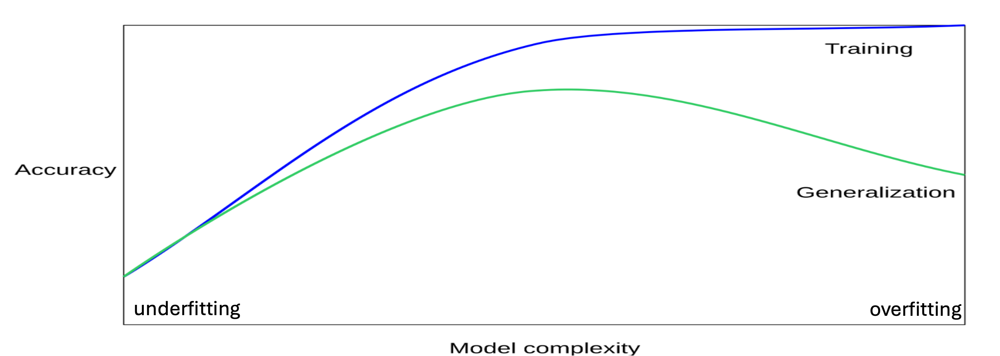
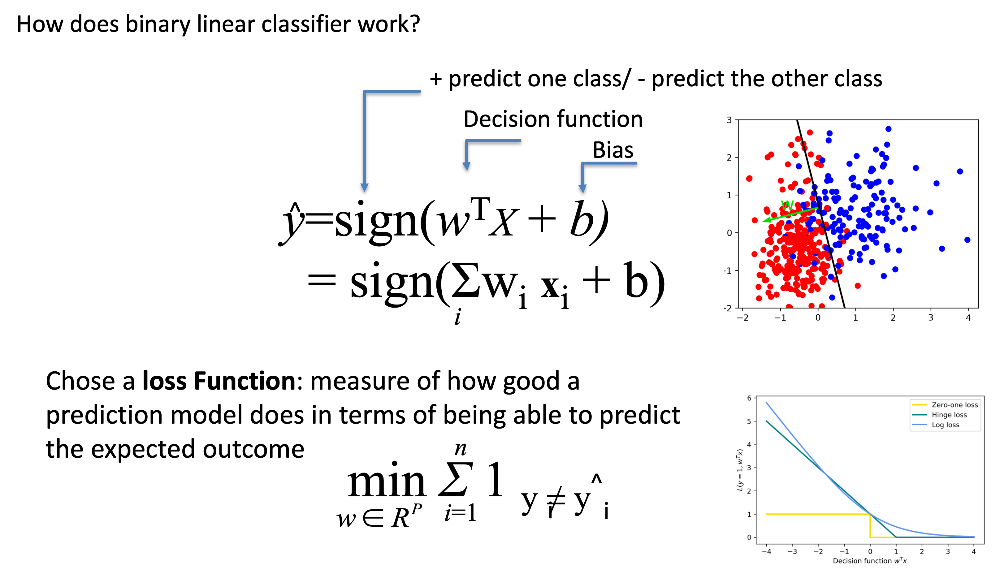
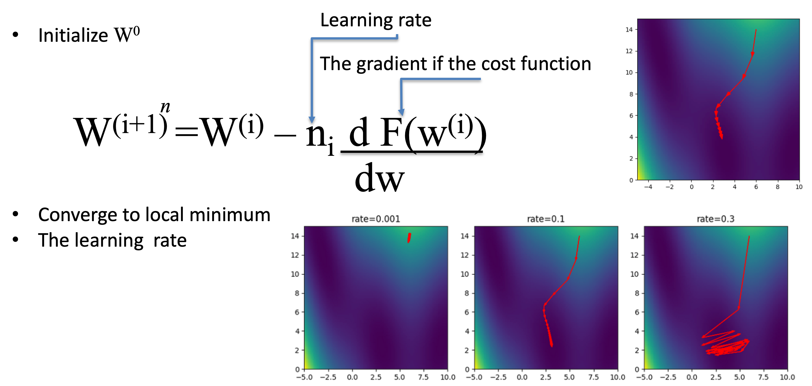

# Module: Foundations of Machine Learning

**Audience:** 1st-year undergraduates  
**Time:** ~120 minutes  

- From **rules** to **learning from data**
- Core **ML concepts** and **workflow**
- Types of models: **linear / non-linear**, **parametric / non-parametric**
- How models **learn** (loss, optimization)
- **Evaluation**, overfitting, and **data / ethics**

---

# Plan for Today

1. Why Machine Learning? (from rules to learning)
2. Core ML concepts & workflow
3. Models and data: linear vs non-linear, parametric vs non-parametric
4. How models learn: loss, gradient descent
5. Evaluating models & avoiding traps
6. Real-world issues: data quality & bias
7. Wrap-up & questions

---

# 1. Why Machine Learning?

**Before ML (Rule-based world)**

- Symbolic AI: humans write **If–Then** rules
- Works well when:
  - Rules are clear
  - Data is clean and structured
- Fails when:
  - Data is noisy, messy, ambiguous
  - Patterns are too complex to write down

---

# The New Way: Machine Learning

- **Goal:** Build **learners**, not hand-written rules
- We provide **data** (examples), not logic
- The computer **learns patterns** from data
- We design:
  - The **model form** (architecture)
  - The **learning algorithm**

**Key idea:**  
Instead of programming every rule, we **optimize a model** to fit the data.

---

# Discussion (2–3 min)

With a neighbor:

- Name one app or service you use (search, maps, recommendations, spam filter…).
- Which parts could be **fixed rules**?
- Which parts are likely **learned from data**?

We’ll collect 2–3 examples.

---

# 2. Core Machine Learning Concepts

We’ll use these terms all 

- **Data set**: collection of examples
- **Features**: input variables (x)
- **Labels / targets**: what we want to predict (y)
- **Model**: mathematical function mapping x → y
- **Training**: fitting the model to known data
- **Testing**: checking performance on unseen data

---

# What is Machine Learning?

> “ML is a scientific discipline that deals with the construction and study of algorithms that can learn from data. Such algorithms operate in two steps:
> 1. Building a model based on the data  
> 2. Using the model to make predictions and decisions rather than following explicitly programmed instructions.”

---

# Types of Machine Learning (Overview)

- **Supervised learning**
  - Inputs **and** labels
  - E.g., spam vs not-spam, disease vs no disease, house prices

- **Unsupervised learning**
  - Only inputs (no labels)
  - E.g., clustering customers, discovering groups

- **Reinforcement learning**
  - Agent interacts with environment, receives **rewards**
  - E.g., game-playing, robot control

In this module we focus on **supervised learning**.

---

# ML Workflow: Big Picture

Typical **modelling lifecycle**:

1. **Define the problem**  
   (classification / regression / other)
2. **Collect & explore data**
3. **Pre-process** and clean data
4. **Choose a model** (algorithm)
5. **Train** the model on training data
6. **Validate / tune** the model
7. **Test** the model on unseen data
8. **Deploy** and **monitor** in the real world

---

# The Machine Learning Work-Flow (Simplified)

1. **Input data**  
2. **Feature extraction / engineering**  
3. **Choose model + train**  
4. **Evaluate**  
5. **Deploy & use**

(We’ll walk through each part at a high level.)

---

# Is the Data Ready?

Often: **No**

- Wrong format (images, voice, text, logs)
- **Missing values** (e.g., unknown age)
- **Noise** and errors

We need:

- **Pre-processing** (cleaning, normalizing, encoding)
- **Feature selection** (which variables matter?)
- **Feature engineering** (creating new useful features)

---

# Datasets: Train, Validation, Test

We don’t use all data at once:

- **Training set**
  - Used to **fit** the model
- **Validation set**
  - Used to tune **hyperparameters** (settings)
- **Test set**
  - Used once, at the end, to estimate **generalization**

Typical simple split:

- 70–80% train
- 20–30% test  
(or train / validation / test).

---

# How to Split Data (Concept)

Ways to split:

- Simple **train/test split**
- **Train / validation / test**
- **Cross-validation** (CV):
  - Use multiple folds; each fold gets a chance to be test data
  - More stable estimate, but slower
- Special strategies:
  - **Stratified** splits (keep class proportions)
  - **TimeSeriesSplit** for time-ordered data

We won’t go into code details, but the **idea** is important.

---

# 3. What Is a Model?

**Formal view**

- A model is a function  
  $$f(x) \to y$$
- It has **parameters** (weights) that we learn

**Intuition**

- Model = **recipe**
  - Inputs = ingredients
  - Weights = how much of each ingredient
  - Output = final dish
- Training adjusts the recipe until dishes taste “correct” on average.

---

# Linear vs Non-Linear Models (Idea)

- **Linear model**
  - Assumes a **straight-line** relationship
  - Example form:  
    $$y = w_1x_1 + w_2x_2 + \dots + b$$
  - Decision boundaries are lines / planes

- **Non-linear model**
  - Can bend and curve
  - Captures complex patterns (circles, waves, etc.)

Examples we’ll name (no math details):

- Linear: Linear Regression, Logistic Regression, Linear SVM
- Non-linear: Decision Trees, k-NN, Kernel SVM, Neural Networks

---

# Parametric vs Non-parametric Models

**Parametric models**[2]

- Number of parameters is **fixed**, independent of dataset size
- Examples:
  - Linear models
  - Centroid-based models
- Pros: Simple, fast, less memory

**Non-parametric models**

- Number of parameters can **grow with the data**
- Examples:
  - k-Nearest Neighbors
  - Many non-linear SVMs
  - Decision Trees
- Pros: Very flexible, can fit complex patterns

---

# Example: A Linear Model

Predict exam score (y) from hours studied (x):

- Plot points (hours, score)
- Try to draw the **best straight line** through them
- Use this line to predict scores for new students

This is **linear regression**: a classic parametric, linear model.

---

# Example: A Non-Linear Model

What if the relationship is not a straight line?

- Example: Performance increases with study time up to a point, then drops (over-study).
- A linear model struggles with this pattern.
- A **non-linear model** (like a decision tree or neural network) can bend the boundary to fit such shapes.

**Lesson:** choose model complexity to match **data complexity**.

---

# Early and Common ML Problem Types

Early ML and modern ML solved:

1. **Game playing**
   - Strategy and search (checkers, tic-tac-toe, backgammon)
2. **Pattern classification**
   - Handwritten digit recognition, signal classification
3. **Regression**
   - Predicting continuous values (trend forecasting)
4. **Diagnostic support**
   - Early “expert systems” using data (e.g., medical support)

Common pattern:  
**input → transformation → output**  
learning the right transformation from data.

---

# 4. Models as Transformations (Matrices)

We often represent:

- Input data as **vectors** (lists of numbers)
- Model parameters as **matrices** (tables of numbers)

**Matrix transformation:**

- Input vector × matrix → output vector
- Geometric view: rotates and stretches the space

Learning = finding matrix values that make classes **separable**.

---

# Visual Intuition: Space as Data

Imagine:

- Each example (image, email, etc.) is a point in a huge **room**
- Initially, points from different classes (cats/dogs) are mixed

A model (matrix):

- **Reshapes** the room (rotations, stretches)
- Tries to move cats to one side, dogs to the other
- So we can draw a **simple boundary** between them

---

# Optional Insight (Instructor Note)

For you (not necessarily for students):

- Most directions (vectors) in space are rotated and scaled by a matrix.
- **Eigenvectors** are special: they keep their direction, only scale changes.
- In complex models, stable directions can correspond to important latent features.

You can mention “some directions in the data are more stable and important than others” without the word “eigenvector”.

---

# From Rigid Maps to Dynamic Transformations

**Symbolic AI (Rigid Map)**

- Knowledge = fixed rules
- If data doesn’t match rules → failure
- Hard to maintain/update

**Machine Learning (Dynamic Transformation)**

- Knowledge = flexible parameters (weights in matrices)
- Model adapts to data
- We **optimize** the transformation, rather than writing rules

---

# Analogy: Funnels and Water

- **Symbolic AI**
  - Rigid metal funnel
  - If water (data) comes from wrong angle, it spills
- **Machine Learning**
  - Flexible funnel
  - Changes shape/angle to catch water from many directions

**Takeaway:** ML changes the **model** to fit messy data.

---

# 5. How Models Learn: Training

We don’t know good weights upfront.

Training loop (conceptual):

1. Start with **random** weights (bad model)
2. Use model to make predictions on training data
3. Measure how **wrong** we are (loss function)
4. Adjust weights to reduce loss (optimization)
5. Repeat many times until performance stabilizes

---

# The Loss Function: Measuring Wrongness

- Loss function = **error score**
- Compares model prediction vs true label
- Larger loss → worse performance

Examples:

- **Mean Squared Error** (regression)
- **Cross-Entropy Loss** (classification)

We choose a loss function appropriate to the **task**.

---

# Gradient Descent: Improving the Model

Imagine loss as a **mountain landscape**:

- Height = error
- We want to reach the **lowest valley**

**Gradient descent**:

- At the current point, compute the **slope** (gradient)
- Move a small step in the direction of **steepest descent**
- Repeat → gradually go downhill towards lower loss

---

# Learning Rate: Step Size

**Learning rate** = how big each step is:

- Too large:
  - Jump over the valley
  - Training becomes unstable
- Too small:
  - Training is very slow
  - Can get stuck

Analogy: Hiking in the fog:

- You feel slope, but you don’t see the whole mountain.
- Step size matters.

---

# Weights as Dials

Think of each weight as a **dial**:

- The model has **many dials** controlling how features affect output.
- Loss function = judge shouting louder when the output is wrong.
- Training:
  - Turn each dial a little.
  - If the judge shouts less → keep turning that way.
  - Repeat until the shouts are minimized (loss is small).

---

# Quick Check (3–4 min, pair discussion)

In pairs:

1. What does the **loss function** tell us?
2. What does **gradient descent** change?
3. Why is **learning rate** important?

We’ll collect a few answers.

---

# 6. Choosing Algorithms: A Glimpse

There are many models with different properties:

- **Basic models**
  - Nearest Neighbours
  - Nearest Centroid
  - Linear Classification & Regression
  - Logistic Regression
- **Non-linear models**
  - Support Vector Machines (SVMs) & kernels
  - Decision Trees
  - Random Forests
  - Gradient Boosting

Choice depends on:

- Data size and type
- Interpretability needs
- Computational limits

---

# Underfitting vs Overfitting

When training models:

- **Underfitting**
  - Model too simple
  - Misses important patterns
  - Bad on both train and test data

- **Overfitting**
  - Model too complex
  - Memorizes noise in training data
  - Good on train, bad on test

There is a **“sweet spot”** in model complexity[2].

---

# Visual Intuition: Model Complexity

- Simple model: almost straight line → **underfits**
- Very complex model: wiggles through every point → **overfits**
- Good model: captures main trend without chasing every outlier → **sweet spot**[2]

Goal: **generalization** → good performance on **unseen** data.

---

# Train / Validation / Test & Cross-Validation

To find the sweet spot:

- Use **validation data** to tune hyperparameters (e.g., tree depth, #neighbors)[3][4]
- Use **cross-validation** for more reliable estimates:
  - Split data into k folds
  - Train on k−1 folds, test on remaining fold
  - Repeat k times, average performance
- Then finally evaluate once on the **test set**.

---

# Model Families (Names Only)

Just to recognize names:

- **Linear models**:
  - Linear Regression, Logistic Regression
- **Distance-based**:
  - k-Nearest Neighbors, Nearest Centroid
- **Tree-based**:
  - Decision Trees, Random Forests, Gradient Boosting
- **Margin-based**:
  - Support Vector Machines (linear & kernel)
- **Neural Networks**:
  - From shallow networks to Deep Learning

Details will come later in the course.

---

# 7. Evaluation Metrics: Beyond Accuracy

Example: fraud detection

- Fraud = 0.015% of transactions
- Model that always predicts “not fraud”:
  - Accuracy ≈ 99.985%
  - Catches **zero** fraud cases

Accuracy alone can be **misleading**.

Important metrics:

- **Precision**: of predicted positives, how many are truly positive?
- **Recall**: of true positives, how many did we catch?

Metric choice must match **real-world costs**.

---

# 8. The Reality of Data: "Garbage In, Garbage Out"

Models learn whatever is in the data:

- **Incomplete** training data → models fail in new situations
- **Noisy** data → unstable predictions
- **Biased** data → biased models

Most ML effort in practice:

- Data collection
- Cleaning & preprocessing
- Careful evaluation

---

# Ethics Example: Biased Hiring

Simplified real case:

- Company trains model on 10 years of past hiring data.
- Historical hires are mostly from one group (e.g., men).
- Model learns to favor:
  - Certain keywords
  - Certain schools
  - Certain CV patterns
- It down-ranks others (e.g., women’s colleges, “women’s club”).

**Lesson:**  
Models reflect **historical bias** unless we actively detect and correct it.

---

# Discussion (5–7 min)

In groups:

1. Why is biased data dangerous in ML?
2. Can a technically “good” algorithm still be unfair?
3. Who should be responsible for monitoring ML systems in society?

Share 1–2 key points with the class.

---

# 9. Historical Engines (Optional Brief Story)

Post-symbolic key developments:

- **1980s–1990s:** Neural networks + **Backpropagation**
  - Enabled training of multi-layer networks
- **1990s–2000s:** Statistical learning
  - **SVMs**, **Random Forests**, **Bayesian networks**
  - Focus on probability and optimal boundaries
- **2010s–now:** Deep Learning
  - Big data + GPUs → hierarchical feature learning
- **2020s–now:** Transformers / Generative AI
  - Context-aware transformations, large language models

Give students a sense of **evolution**, not only tools.

---

# 10. Summary: Foundations of ML

You should now be able to:

- Explain why we moved from **rules** to **learning from data**
- Describe the **ML workflow** (data → model → evaluation)
- Distinguish **linear vs non-linear**, **parametric vs non-parametric** models
- Explain **loss**, **gradient descent**, and **learning rate**
- Understand **underfitting vs overfitting** and why we split data
- Recognize why **data quality** and **bias** are critical

---

# Exit Ticket (2–3 min)

Write or discuss:

1. One concept you feel you **understand well**  
2. One concept you’re **still unsure** about  
3. One **real-world problem** where ML might be useful

We’ll use your answers to decide what to revisit next time.

---

# Thank You

Next modules:

- Symbolic AI vs ML (deeper comparison)
- Specific model families and simple hands-on demos

Questions?

--

# SECTION I  
## The Paradigm Shift in Computing

---

# From Rules to Optimization

- Core question:  
  **How do we get machines to do what we want?**

 

---

# From Rules to Optimization

- Core question:  
  **How do we get machines to do what we want?**
- Old paradigm:  
  Humans **write explicit rules** the machine follows.
- New paradigm:  
  Machines **learn rules** via **mathematical optimization** on data.
- Enabler:  
  Big Data + large‑scale compute (data centers, clusters, GPUs).
---

# The Traditional Approach: Explicit Programming

**Workflow**

- Humans design and script fixed **rules**.
- Rules + input **data** are executed by the computer.
- System outputs an **answer**.

**Design profile**

> [Rules] + [Data] → **Program** → [Answers]

**Limitation**

- Works only when humans can **precisely specify** the rules  
  (e.g. sorting numbers, tax calculations, chess search).

  

---

# The Machine Learning Approach

**Inversion of control**

- Instead of coding rules:
  - Provide **data** + **target answers** (labels).
- A learning algorithm:
  - Adjusts internal parameters via iterative **training**.
- Result:
  - Learned **rules / model**.

**Design profile**

> [Data] + [Answers] → **ML Training** → [Rules / Model]

---

# The Dual Fuel of Modern AI

To discover useful rules **without explicit programming**, we need:

- **Massive datasets (Big Data)**
  - Many diverse examples → better generalization
- **Massive processing power (Data Centers)**
  - Billions of matrix operations
  - Highly parallel hardware (GPUs, TPUs, clusters)

Without enough **data** or **compute**, many ML methods fail in practice.

---

# Taxonomy of Machine Learning

Three broad families:

- **Supervised Learning**
  - Learn from labeled examples (input → known output).
- **Unsupervised Learning**
  - Discover structure in unlabeled data.
- **Reinforcement Learning**
  - Learn to act via rewards and penalties over time.

We’ll briefly illustrate each.

---

# Supervised Learning

**Goal**

- Learn a mapping from inputs to outputs  
  using labeled example pairs.

**Data**

- Requires **human‑labeled** or otherwise verified targets.

**Common tasks**

- **Classification**
  - Fraud detection, image labeling, medical diagnosis.
- **Regression**
  - Predicting prices, demand, or continuous trends.

---

# Unsupervised Learning

**Goal**

- Find **hidden structure** or distributions in unlabeled data.

**Data**

- Only raw inputs; no explicit labels.

**Common tasks**

- **Clustering**
  - Group customers by behavior patterns.
- **Dimensionality reduction**
  - Compress high‑dimensional data into fewer, informative features.

---

# Reinforcement Learning

**Goal**

- Train an **agent** to choose actions that maximize long‑term reward.

**Mechanism**

- Trial‑and‑error interaction with an **environment**.
- Receives **rewards / penalties** rather than labeled examples.

**Key ideas**

- Agent–environment loop
- Value functions: estimated future reward

---

# What Is Machine Learning?

> “Machine Learning is the scientific discipline concerned with algorithms that can **learn from data**.”

Two phases:

1. **Model building (training)**
   - Use historical data to fit an empirical model.
2. **Inference (deployment)**
   - Use the model to make predictions on **new** data  
     instead of following fixed, hand‑coded logic.

---

# What Is Machine Learning?

- Before ML (Rule based world)
- Type of ML supervised, non supervised, reinforced 
- ML Algorithms
- Breakthrough in ML

<iframe 
width="951" 
height="535" 
src="https://youtu.be/7JhjINPwfYQ" 
title="Machine Learning Introduction | Machine Learning Tutorial | Simplilearn" frameborder="0" allow="accelerometer; autoplay; clipboard-write; encrypted-media; gyroscope; picture-in-picture; web-share" referrerpolicy="strict-origin-when-cross-origin" allowfullscreen>
</iframe>

---

# SECTION II  
## Data Pipelines & Workflows
---

# The Reality of Data

Raw data is **not** ready for ML:

- **Heterogeneous formats**
  - Images, audio, text, logs, tables
- **Missing values**
  - Gaps in records, broken rows
- **Noise**
  - Sensor errors, outliers, typos
- **Feature transformation**
  - Encoding categories, scaling, normalizing, engineering features

Much of ML practice = **data cleaning and preparation**.

---

# The End‑to‑End ML Workflow

High‑level pipeline:

1. **Input training data**
2. **Feature extraction / preprocessing**
3. **Train / fit model**
4. **Create trained model**

Then:

1. **Input test (or new) data**
2. Same **feature extraction**
3. **Evaluate / score** with the model

> Goal: good performance on **unseen** data, not only training data.

---

# Generalization: Underfitting vs Overfitting

**Underfitting (High Bias)**

- Model too simple → misses important patterns.
- Example: straight line fitted to a highly curved relationship.

**Overfitting (High Variance)**

- Model too complex → memorizes noise and outliers.
- Example: high‑degree polynomial that hits every training point but fails on new data.

Good models strike a **balance**.

---

# Validation Strategies

To measure generalization properly:

- **Train / Test split**
  - Simple: e.g. 75% train, 25% test.
- **Train / Validation / Test**
  - Train: fit parameters  
  - Validation: tune hyperparameters  
  - Test: final unbiased evaluation
- **Cross‑validation (e.g. K‑fold)**
  - Rotate which subset acts as validation.
- Variants:
  - Stratified CV, nested CV, time‑series splits.

---

# Algorithm Choice and Complexity (Overview)

Different models have different costs:

- **Linear models**
  - Fast to train and predict; low memory footprint.
- **Instance‑based methods (e.g. KNN)**
  - Almost no training cost; slow prediction; high memory.
- **Tree‑based models (e.g. decision trees)**
  - Training cost grows with number of samples and features.
  - Prediction cost grows with tree depth.

Choosing an algorithm means balancing:

- Data size and dimensionality
- Memory and latency constraints
- Required accuracy and interpretability

---

# Beyond Superficial AI Skills

**Superficial use**

- Treats AI as a black box.
- Knows how to call `.fit()` and `.predict()` on standard libraries.

**Engineering reality**

- When models fail in production, we must:
  - Diagnose data issues and pipeline bugs.
  - Understand model behavior (e.g., bias/variance tradeoff, feature effects).
- For advanced systems (deep learning, Transformers), this includes:
  - Backprop dynamics, vanishing/exploding gradients
  - Embeddings, attention, and model architecture choices.

Deep understanding turns AI from a **gadget** into a **reliable tool**.

---

# SECTION III  
## Data Infrastructure & Storage Realities

---

- Data grows from **kilobytes** to **yottabytes**
- Moving data is limited by **physics** (bandwidth, latency)
- Computing on data needs **parallelism** (clusters, GPUs, TPUs)

---

# The Scale of Modern Big Data

- Storage units grow by factors of **10³**:

  $$
  \text{KB} \rightarrow \text{MB} \rightarrow \text{GB} \rightarrow 
  \text{TB} \rightarrow \text{PB} \rightarrow \text{EB} \rightarrow 
  \text{ZB} \rightarrow \text{YB}
  $$

- 1 **Terabyte (TB)** = $10^{12}$ bytes  
- 1 **Zettabyte (ZB)** = $10^{21}$ bytes  
  - Roughly the order of **global internet traffic** in a year

---

# What Does 1 TB Look Like?

Approximate capacity of a **1 TB drive**:

- ≈ **200,000** high‑quality audio files  
  - ~17,000 hours of music
- ≈ **256** standard‑definition 2‑hour movies  
  - ~500 hours of video
- ≈ **310,000** standard‑resolution photos

Even a **single TB** is a lot of real‑world content.

---

# Global Data Ingestion (Examples)

Why scalable infrastructure matters:

- **Google**:  
  - >20 **Petabytes/day** processed in distributed systems
- **Facebook** (Meta):  
  - >2.5 **PB/day** of user activity in data lakes
- **CERN – Large Hadron Collider**:  
  - ~15 **PB/year** of raw detector data

Modern AI is tied to this scale of data flow.

---

# The “Sneakernet” Bandwidth Paradox

Moving huge datasets over networks is hard:

- Transferring **hundreds of TB** over typical links hits hard bandwidth limits
- 2013 perspective:
  - Shipping physical **hard drives by plane** could be **faster** than the internet

Example:

- A 1 TB SSD ≈ 78 g  
- A plane full of drives → effective rate ≈ **150 EB/day**  
  - ≈ **14 Pb/s**, about **100×** average internet throughput (2013)

---

# Network Transfer Latency – Thought Experiments

**Case 1: 18 TB (≈ 60 human genomes)**

- Over a **1 Gbps** line:
  - Transfer takes **days**, even with perfect utilization

**Case 2: 1 Exabyte (EB = $10^6$ TB)**

- Over a dedicated **10 Gbps** link:
  - ≈ **26 years** of continuous upload

**Reality:**  
Cloud providers use **physical transfer** tools (e.g. AWS Snowmobile trucks) to move EB‑scale data in **weeks**.

---

# Processing Latency: The Terabyte Sort

How long to sort **1 TB** of data?

- **Single machine**
  - Disk read/write ≈ 100 MB/s
  - Idealized processing: ≈ **341 minutes** (~5.6 hours)

- **Large distributed cluster**
  - 2008 benchmark (MapReduce on 910 nodes):
  - 1 TB sort in **68 seconds**

Parallelism can turn **hours into seconds**.

---

# Does Adding CPUs Always Help?

Computational scaling behaviors:

- **Linear scaling**
  - 2× cores → ~2× speedup
- **Super‑linear scaling**
  - Better than linear (e.g. data now fits in caches across nodes)
- **Sub‑linear scaling (Amdahl’s Law)**
  - Diminishing returns:
    - Sequential parts of the code
    - Network communication overhead
    - Synchronization costs

More hardware ≠ unlimited speedup.

---

# Hardware Acceleration: GPUs & TPUs

**CPUs**

- Optimized for **sequential**, diverse tasks
- Great for control logic, but slow for massive matrix math

**GPUs / TPUs**

- Thousands of simple arithmetic units
- Designed for **parallel** operations:
  - Millions of multiply‑adds in parallel
- Essential for:
  - Deep learning training
  - Large‑scale simulations

Example:

- Complex biomedical simulations that take hours on a CPU  
  can be sped up dramatically using OpenCL/CUDA on GPUs.

---

# What Is Machine Learning?

- Vector Feature
- Sample
- Feature space
- Example of ML library: MLlib spark

<iframe 
width="951" 
height="535" 
src="https://youtu.be/seG9J49bBYI " 
title="Machine Learning Introduction | Machine Learning Tutorial | Simplilearn" frameborder="0" allow="accelerometer; autoplay; clipboard-write; encrypted-media; gyroscope; picture-in-picture; web-share" referrerpolicy="strict-origin-when-cross-origin" allowfullscreen>
</iframe>
