# Micro-credentials as a Complement to University Curricula

**Audience:** University lecturers & programme directors  
**Context:** DIGITAfrica – digital skills and research infrastructure

> DIGITAfrica Consortium, *DIGITAfrica D4.2: Competence Framework and Modular Curricula*, ver. 1.0, 2026. Project deliverable, pan‑African digital sciences capacity‑building initiative.

---

## Roadmap of the Talk

- Why micro-credentials now?
- What they are (and are not)
- How they complement degree programmes
- Integration at course and programme level
- Lifelong learning, assessment, certification, recognition
- Platforms and implementation
- Conclusions and discussion

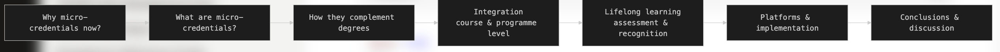

---

## Why micro-credentials now?

- Rapid evolution of **digital technologies and infrastructures**
- Growing **mismatch** between traditional curricula and industry demands  
  - Students request concise, practice-oriented training 
  <!--in advanced programming, cloud, AI ethics, cybersecurity, blockchain, digital entrepreneurship, UI/UX, etc. -->
- Need for **flexible, stackable learning units** that can be updated quickly
- Pressure to support **lifelong learning** for professionals, not only full-time students  

> **Question for us:** How can universities respond without abandoning degree structures?

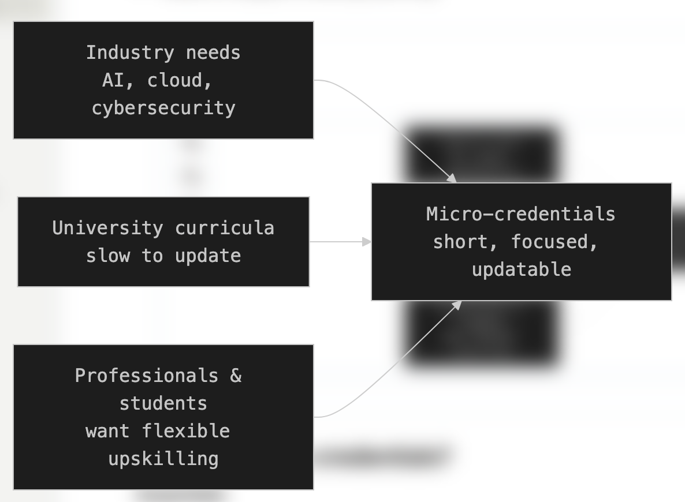

---

## What are micro-credentials?

Key characteristics:

- **Short, focused** learning experiences
- **Defined learning outcomes** and **competence levels** 
- **Formal assessment** of knowledge and skills  
- Result in a **verifiable certificate or digital badge** (the “micro-credential”)  
- Designed to be **stackable** (combine into larger qualifications) and **portable** across institutions and borders

> “Micro-credentials provide the means to prove competence and skills in a specific domain after a short learning experience.” 

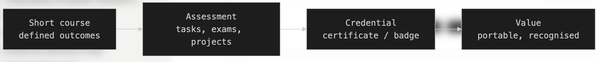

---

## Micro-credentials vs degrees

**Degree programmes**

- Provide **foundational disciplinary knowledge**
- Emphasise broad academic formation and research skills
- Are relatively **slow to change** at curriculum level

**Micro-credentials**

- Focus on **specific, often advanced or emerging topics** 
- Are **short**, easier to **update** with changing technologies
- Target both **students / professionals** for (up/re)skilling  

> **Relationship:** Micro-credentials **complement** legacy academic paradigms rather than replace them. 

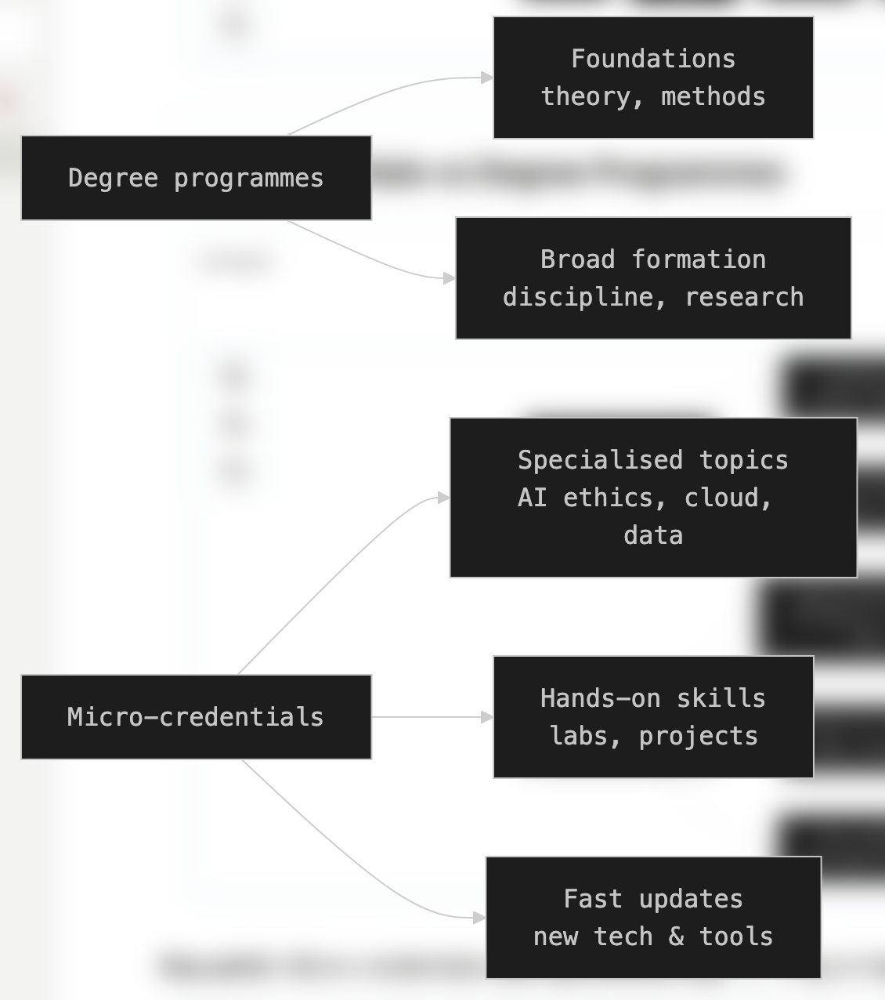

---

## Integration at course level

Micro-credentials can be integrated into existing courses:

- As **specialised modules** within a course  
  - E.g. “Practical Edge AI on cloud platforms” attached to a core AI course 
- As **standalone short courses** that carry defined academic credits  
  - Mapping workload to ECTS or similar (e.g. 25–30 hours ≈ 1 ECTS) 
- Assessment is aligned with:
  - Intended competences |  Institutional quality assurance processes 

> Result: Students gain both **course credit** and a **micro-credential** signalling.

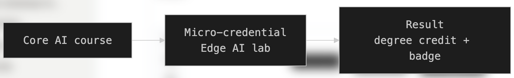

---

## Integration at programme level

Micro-credentials can structure **specialisation tracks**:

- Bundle several micro-credentials into a **programme pathway**  
  - E.g. “AI & Big Data” track, “Networking & Cloud Computing” track, aligned with DIGITAfrica blueprints  
- Use micro-credentials as:
  - **Elective components** in master’s or PhD programmes 
  - **Bridges** between different programmes or institutions  
- Enable **stackability**:
  - Individual units → specialisation

> This increases programme flexibility while preserving the degree framework.

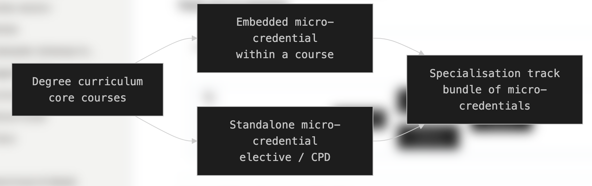

---

## Lifelong learning & multi-level capacity building

Micro-credentials are central to **lifelong learning**:

- **Individual level**  
  - Students, early-career researchers acquire verifiable, competency-based skills 
  <!--in AI, data infrastructures, distributed systems-->
- **Institutional level**  
  - Universities embed micro-credentials in curricula and continuing professional development (CPD) 
- **Ecosystem level**  
  - Alignment with national strategies, regional bodies, and continental frameworks (e.g. African Continental Qualifications Framework)  

> UNESCO sees micro-credential ecosystems as key enablers of **lifelong learning and skills development**.  

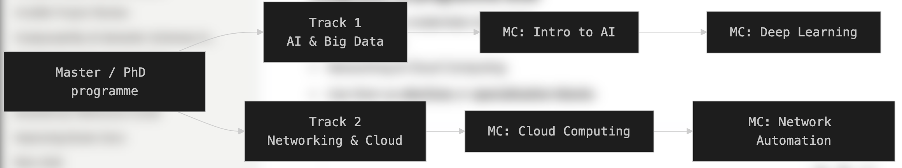

---

## Content, assessment, and certification

Short training **is not** automatically a micro-credential.

Essential components:

1. **Standard and curriculum definition**  
   - Competence levels aligned with frameworks (EQF, e-CF, ACQF)   
2. **Course delivery**  
   - In-person, online, or blended; practice-oriented, hands-on sessions   

> Without assessment, only **certificates of participation** can be issued, not true micro-credentials. 

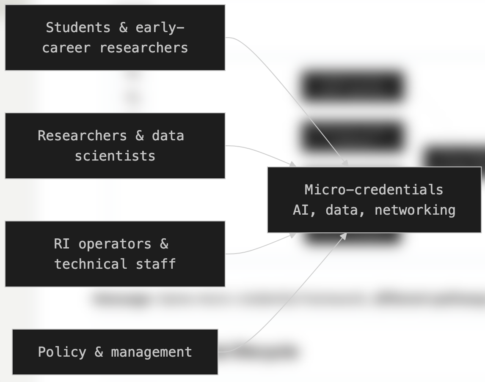

---

## Content, assessment, and certification

Short training **is not** automatically a micro-credential.

Essential components:

3. **Assessment of knowledge and skills**  
   - Performance-based, project-based, practical demonstrations  
   - Virtual labs, online quizzes/exams, e-portfolios, self-assessment, industry validation 
4. **Credential award**  
   - Verifiable certificate or badge issued **after** successful assessment 

> Without assessment, only **certificates of participation** can be issued, not true micro-credentials. 

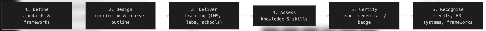

---

## Recognition, trust, and value

A micro-credential has value when it is:

- **Verifiable** : Secure technical verification (e.g. Open Badges, digital signatures)  
- **Portable** : Recognised across institutions and borders; mapped to EQF, e-CF, ACQF   
- **Industry-aligned** : Learning outcomes co-defined with employers and sector stakeholders  
- **Institutionally anchored**:  Issued by universities and research infrastructures, not only private providers 

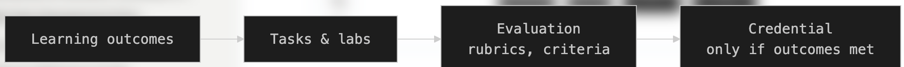

> This combination builds **trust** among employers, public institutions, and learners. 

---

## Platforms for micro-credential delivery

Platforms must support the **end-to-end micro-credential lifecycle**:

- **Content and training delivery**
  - Institutional LMSs hosting micro-credential modules 
  - Repositories for training materials and lab manuals (e.g. GitHub, cloud storage)  
- **Assessment and analytics**
  - LMS tools for quizzes, assignments, e-portfolios, lab integration  
  - Real-time reports and analytics for quality assurance 
- **Certification and digital credentials**
  - Issuing verifiable certificates/badges (e.g. integrated with Open Badges)  
  - Integration with environments like the **DIGITAfrica Playground** for technical “proof of work” 

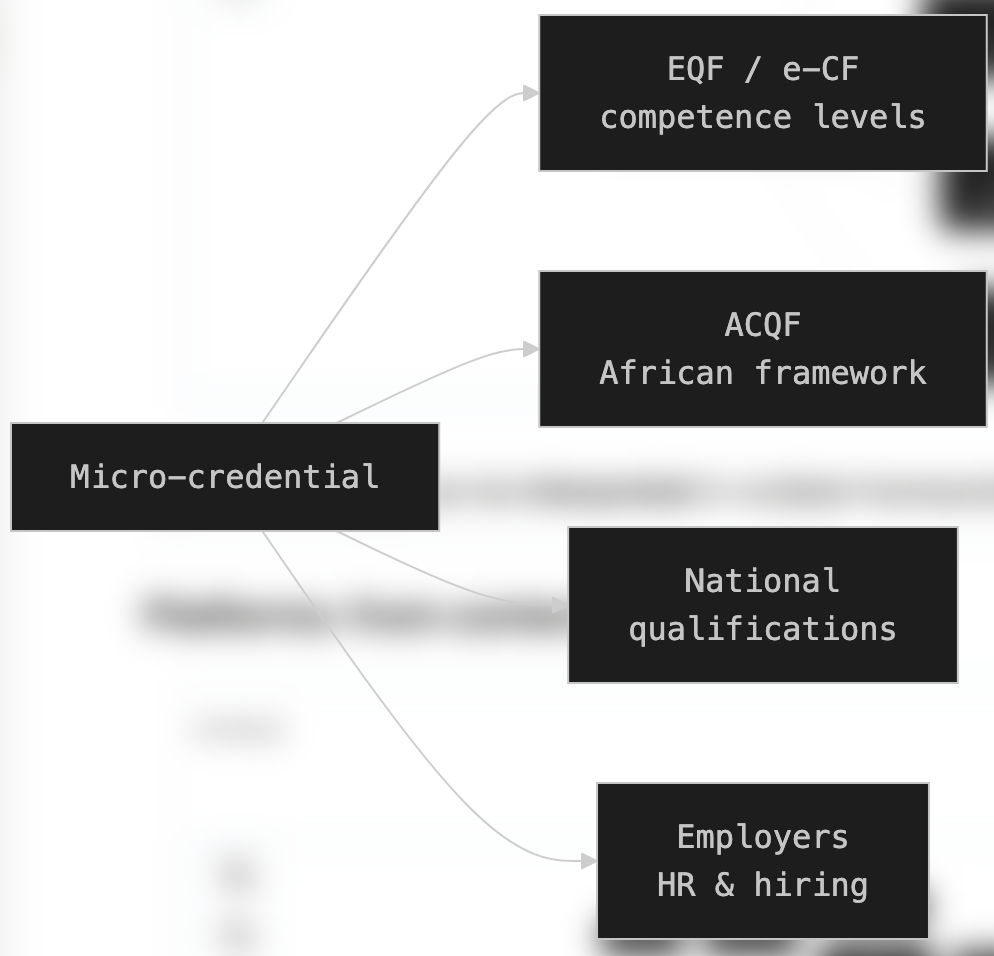

---

## Example: DIGITAfrica winter school

- **Event:** Winter school at Strathmore University (Kenya, March 2026)  
- **Tracks:**  
  - AI & Big Data  
  - Networking & Cloud Computing 
- **Features:**
  - Blueprint-aligned curriculum (Edge AI/ML, Heterogeneous Networking) 
  - Hands-on practical sessions, labs, in-person delivery

---

## Example: DIGITAfrica winter school

> **Lesson learned:**  
> - Participants received **certificates of participation** because no formal assessment was implemented → not full micro-credentials yet.
> - the importance of **embedded assessment** and **credential framework**.

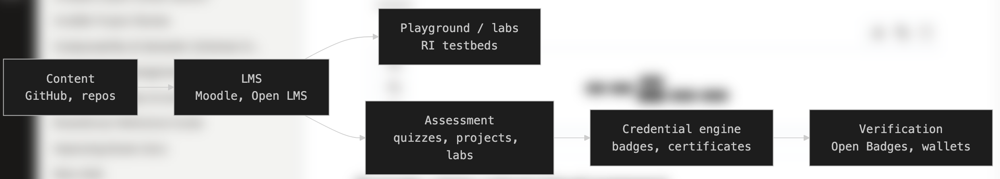

---

## Institutional and ecosystem sustainability

DIGITAfrica proposes a **hybrid sustainability model** where micro-credentials:

- Act as a **connecting layer** between:
  - Public ownership (universities, ministries)
  - Institutional co-financing
  - Service-based mechanisms (certified training, sandbox access)
- Are anchored in:
  - Universities (curriculum delivery, credential issuance)
  - National research infrastructures and research & education networks

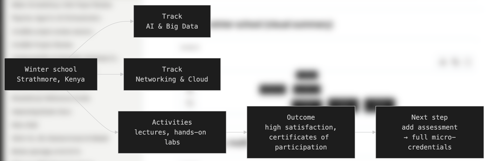

---

## Institutional and ecosystem sustainability

DIGITAfrica proposes a **hybrid sustainability model** where micro-credentials:

- Are supported by:
  - Train-the-Trainer programmes
  - Shared curriculum repositories and LMS integration
  - Cross-infrastructure mentorship and collaboration

> Goal: Move from project-based training to a **self-sustaining ecosystem-level training infrastructure**.

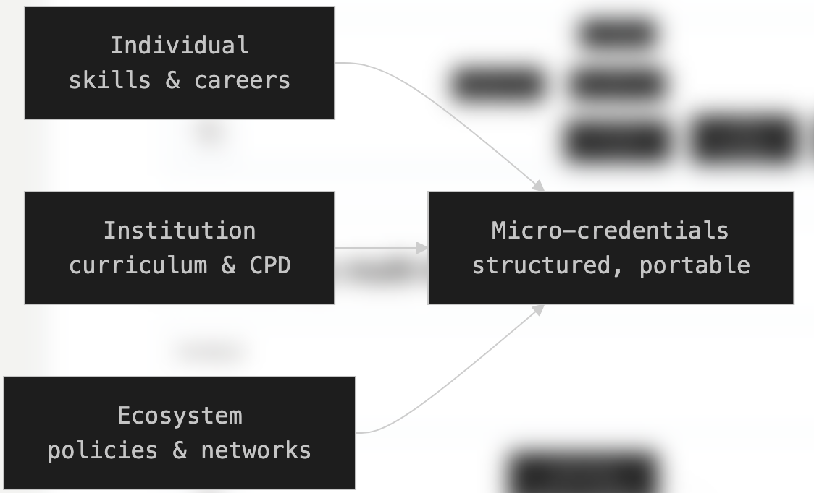

---

## Conclusions & discussion

**Key messages**

- Micro-credentials **complement** degree programmes by:
  - Addressing emerging, practice-oriented skill needs  
  - Providing flexible, stackable, portable learning units[0]  
- Their value depends on:
  - Clear standards and competence frameworks  
  - Robust assessment and verifiable certification  
  - Institutional anchoring and recognition by employers and qualification authorities     

**Questions for the audience**

- Where in your programmes could micro-credentials:
  - Add value (specialisations, electives, CPD)?
  - Support lifelong learning for professionals?
- What institutional steps are needed to:
  - Define pilot micro-credentials?
  - Ensure assessment, recognition, and sustainability?

---
# References

DIGITAfrica Consortium, *DIGITAfrica D4.2: Competence Framework and Modular Curricula*, ver. 1.0, 2026. Project deliverable, pan‑African digital sciences capacity‑building initiative.

Online: https://www.digitafrica.eu/wp-content/uploads/2026/07/DIGITAfrica_D4.2_v1.0.pdf
 